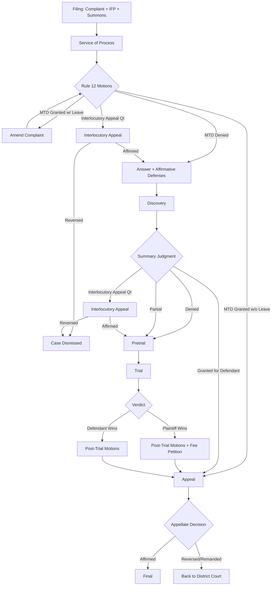

# section1983.org — Requirements

## Purpose

A free, static website (likely Astro) that helps pro se litigants navigate 42 U.S.C. § 1983 civil rights lawsuits against government actors. Not legal advice — a survival guide built by someone who lived it.

## The Reality Check (Front and Center)

The system is rigged. You are suing the government. The government writes the rules, the laws, and funds the judges. The deck is stacked against you from day one. Know this going in.

### Risks

- If your case is found **frivolous**, the government may seek to recover attorney fees, court costs, and expenses from you.
- If you proceed **pro se and with in forma pauperis (IFP/pauper) status**, the practical risk drops — they can't collect what you don't have. But the threat is real and designed to chill lawsuits.
- Judges in your district may have patterns — some are hostile to pro se litigants, some are fair. Research them before you file.

### The Good News

- You have a constitutional right to access the courts.
- § 1983 exists because the government violates people's rights. You're not the anomaly.
- If your facts are real, your complaint is thorough, and you prepare for what's coming, you can survive.

## Core Features

### 1. The Complaint Builder

The complaint is your foundation. Everything flows from it. Everything.

**Requirements:**

- Guide users through writing a complaint that documents **everything that happened** as factual statements
- **No legal conclusions** — don't say "the officer violated my Fourth Amendment rights." Say what the officer did. Let the law match the facts.
- **No mind-reading** — you don't know what the officer knew, observed, or intended. State only what you directly witnessed, heard, or experienced.
- **Don't omit details**, even ones you think don't help. If it happened, it goes in. It gets it on the record. Omissions can't be undone; inclusions can always be contextualized later.
- Teach the difference between factual allegations and conclusory statements (Iqbal/Twombly)
- Structure: parties → jurisdiction → statement of facts (chronological, granular) → claims → relief requested

**Iterative Defense Testing:**

- The complaint should be stress-tested against the most common MTD arguments before filing:
  - Failure to state a claim (Rule 12(b)(6))
  - Qualified immunity (law not clearly established)
  - No conspiracy (intracorporate doctrine, failure to allege agreement)
  - Monell failure (no policy, custom, or final policymaker)
  - Heck bar (if related criminal case exists)
  - Statute of limitations
  - Failure to allege personal involvement
- The user should iterate: draft complaint → bot attacks it with defense arguments → user strengthens the complaint → repeat
- Goal: by the time you file, you've already survived a mock MTD

### 2. The MTD Response Guide

The Motion to Dismiss is the biggest hurdle. Most pro se cases die here. Prepare for it from day one.

**Requirements:**

- Explain what an MTD is and why it matters (this is where the government tries to kill your case without ever having to answer for what they did)
- **Mirror-match framework**: structure your response so each heading matches the movant's exact heading text verbatim. The judge reads the motion and your response side-by-side. Make it easy. Don't reframe — match.
- For each defense argument, provide:
  - What they're claiming
  - What the legal standard actually is
  - How to respond with your facts
  - Common mistakes pro se litigants make
  - Key cases to cite
- Cover qualified immunity in depth — it's the government's favorite escape hatch
- Address Tolan v. Cotton (facts viewed in light most favorable to plaintiff at MTD stage)
- Address the "take the officers at theirs" approach — when defendants' own version of events supports your claims, use it

### 3. Judge Research Tool

**Requirements:**

- Database of federal judges (start with N.D. Tex., expand)
- For each judge: prior § 1983 rulings, grant/deny rates on MTDs, patterns
- Which judges are hostile to pro se? Which give fair readings?
- Which magistrate judges handle screening? What do they look for?
- Link to PACER dockets, published opinions

### 4. Case Law Research

**Requirements:**

- Curated database of § 1983 cases organized by:
  - Claim type (4A arrest, 1A retaliation, 14A due process, excessive force, conspiracy, Monell)
  - Outcome (survived MTD, summary judgment, trial, appeal)
  - District/circuit
  - Key holdings
- **Non-binding decisions matter** — even if a case isn't in your circuit, it can be persuasive authority. Include them.
- Highlight cases where pro se litigants won or survived key stages
- Supreme Court landmarks: Monell, Iqbal/Twombly, Tolan, Nieves, Gonzalez v. Trevino, Graham v. Connor, Kingsley, Ziglar
- Circuit-specific: Turner v. Driver (5th Cir. — right to film police), etc.

### 5. AI Bot — "What Works"

**Requirements:**

- Conversational AI that helps litigants understand what arguments work and don't work:
  - At the federal level generally
  - For specific judges (based on their ruling history)
  - For specific claim types
- Can analyze a draft complaint and flag:
  - Conclusory statements that will get struck under Iqbal
  - Missing factual allegations for each element
  - Qualified immunity vulnerabilities
  - Claims that may be time-barred
- Can suggest strengthening language based on successful complaints in similar cases
- **Does not generate legal conclusions** — helps the user find and apply the right law to their facts
- Should flag when it doesn't know something rather than hallucinate

### 6. Filing Guide

**Requirements:**

- Step-by-step for filing pro se in federal court
- IFP application guide (and why to consider it — practical risk reduction)
- ECF/PACER walkthrough
- Service of process requirements
- Local rules by district (formatting, page limits, certificate of service)
- Timeline: what happens after you file, and when

### 7. Template Library

**Requirements:**

- Complaint template (§ 1983, non-prisoner)
- IFP application
- Civil cover sheet (JS 44)
- Summons
- Certificate of service
- MTD response template (with mirror-match structure)
- Discovery requests (interrogatories, RFPs, RFAs) for after you survive MTD
- Motion templates (extension of time, leave to amend, etc.)

## Technical Requirements

- **Static site** — Astro (or similar SSG)
- **Free to use** — no paywalls, no sign-ups for core content
- **Mobile-friendly** — people in crisis aren't always at a desk
- **Searchable** — full-text search across all content and cases
- **Bot integration** — likely an embedded chat widget backed by an LLM with RAG over the case law database
- **Open source** — this knowledge should be forkable

## Design Principles

- **Write for people in crisis.** They're scared, angry, overwhelmed. Short sentences. Clear structure. No legalese without explanation.
- **Be honest about the odds.** Don't sell false hope. Do give real tools.
- **Judge-liftable content.** Every legal statement on this site should be accurate enough that a judge could rely on it. No editorial narration, no advocacy — facts and law.
- **Earned trust.** Cite everything. Link to sources. Show your work.

### 8. The Economics — Why You Can't Find a Lawyer

This section must be honest about why civil rights plaintiffs struggle to find representation, and what to do about it.

**The Attorney's Calculus:**

- § 1983 cases are fee-shifting (42 U.S.C. § 1988) — the prevailing plaintiff's attorney can recover fees from the defendant. But "prevailing" is the operative word. If you lose, the attorney gets nothing.
- Contingency economics: a civil rights attorney takes your case on contingency (typically 33-40% of recovery). They front all costs — filing fees, expert witnesses, depositions, travel — and eat the loss if you don't win.
- **The threshold injury problem:** For the math to work, the case needs significant damages. That usually means serious physical injury, death, lengthy wrongful imprisonment, or massive economic harm. A bad arrest that lasted a few hours, even if clearly unconstitutional, may result in $5K-$50K in damages — not enough to justify the attorney's risk.
- Result: attorneys cherry-pick cases with catastrophic facts. Everyone else is on their own.

**The Qualified Immunity Tax:**

- Even cases with clear constitutional violations face QI dismissal. An attorney evaluating your case doesn't just ask "were your rights violated?" — they ask "is there a case with nearly identical facts where a court already said this was unconstitutional?" If the answer is no, QI may kill the case regardless of merit.
- This creates a Catch-22: rights can't be "clearly established" until someone wins a case establishing them, but no attorney will take the case because the right isn't clearly established yet.

**When and How to Look for an Attorney:**

- Look early, even if you end up pro se. Many attorneys will give a free consultation.
- Contact your local ACLU chapter, legal aid society, and law school clinics
- Check if your case involves a pattern (multiple victims, same department) — pattern cases are more attractive to attorneys
- Organizations like the Institute for Justice, NAACP Legal Defense Fund, and National Police Accountability Project may take or refer cases
- If you file pro se, you can still seek counsel later — especially if you survive the MTD. A case that survived dismissal is dramatically more attractive to an attorney.
- Be direct: ask "what would this case need for you to take it?" The answer tells you what the market values.

**The Pro Se Reality:**

- Most § 1983 cases are filed pro se. Most are dismissed. This is by design — the system works for the government by being too expensive and complex for ordinary people to navigate.
- But pro se litigants do win. It requires preparation, discipline, and treating the complaint like your entire case — because at the MTD stage, it is.

### 9. The Template Barrier — How Cities Kill Cases on Autopilot

**The Hicks Pattern (5th Circuit / N.D. Tex. Example):**

Some city attorney offices have industrialized the defense of § 1983 cases. They use **template motions to dismiss** — the same brief, with minor find-and-replace edits, filed against every plaintiff regardless of the specific facts.

This is not unique to any one city. It happens everywhere — large departments and small ones, across every federal district. One documented example: the City of Irving, Texas used substantially the same MTD template across six cases spanning 14 years, with 44-70% verbatim identical text. The arguments never changed because they never needed to.

**Why it works:**

- Pro se litigants (Hicks, Young, Winegarner) can't effectively respond to sophisticated QI and Monell arguments
- Represented plaintiffs (Torrez) abandon Monell claims rather than fight the template — it's cheaper to settle the individual officer claims
- The template has **never faced substantive merits opposition** on the Monell claims
- Each dismissal reinforces the next — "see, we always win these"

**What this means for you:**

- If you're suing a city, expect a template MTD. The arguments will be generic: no policy, no custom, no final policymaker, no deliberate indifference.
- **Your response must be fact-specific.** The template is boilerplate; your facts are not. Force the court to engage with what actually happened.
- Research whether the same city attorney office has filed similar MTDs in other cases. Template reuse is itself evidence of a municipal pattern — the city knows about the constitutional violations and has a playbook for avoiding accountability rather than fixing the problem.
- The site's AI bot should be able to identify template reuse across cases in the same district.

### 10. Pre-Filing Investigation — Get the Data Before You Sue

**This may be the most important section on the site.**

Once you file a lawsuit against a government entity, your public records requests will likely be blocked, delayed, or fought. The government will claim litigation privilege, attorney-client privilege, or simply stop responding. **The window for gathering data closes when you file.**

**FOIA / Public Records Requests (Before Filing):**

- Every state has a public records act (FOIA at federal level, state equivalents vary). Use it aggressively before you file.
- **Arrest records** — your arrest, but also the arresting officer's other arrests. Patterns matter.
- **Jail booking data** — who was booked, when, by whom, what charges. Look for patterns of pretextual arrests.
- **Use-of-force reports** — most departments are required to track these. Get them.
- **Internal affairs complaints** — filed against the officers involved in your incident, and their history.
- **Training records** — what training did the officers receive (or not receive) on the constitutional issue in your case?
- **Body camera / dash camera footage** — request it immediately. Retention policies vary; some departments delete footage after 60-90 days.
- **Policies and procedures** — the department's written policies on use of force, arrest procedures, First Amendment activity, etc. These are the foundation of your Monell claim.
- **Officer employment records** — TCOLE (Texas), POST (other states) — when hired, disciplinary history, lateral transfers ("wandering cops").
- **911 call recordings and CAD logs** — the dispatch records of your incident.
- **Prior lawsuits** — PACER search for § 1983 cases against the same department/officers. These are public record.

**Why This Matters for Monell:**

- Monell claims (suing the city/department, not just individual officers) require showing a policy, custom, or pattern. You can't allege a pattern if you don't know about it.
- **Find the data first, then make the claim.** Don't allege a pattern of excessive force and hope discovery proves it. Get the use-of-force data, the prior lawsuits, the complaint history — then write your Monell allegations around what the data actually shows.
- A Monell claim supported by pre-filing data is dramatically harder to dismiss than one that says "on information and belief, the department has a custom of..."

**Practical Tips:**

- Submit records requests the day after your incident, or as soon as you start considering legal action. Don't wait.
- Be specific in your requests — broad requests get delayed or denied. Ask for specific records, date ranges, officer names.
- Keep copies of every request and every response (or non-response). Non-responses are themselves evidence.
- Some states have penalties for government agencies that don't respond to public records requests. Know your state's enforcement mechanism.
- If a request is denied, appeal. Many denials are reflexive and collapse under scrutiny.
- **Track your requests** — date sent, date acknowledged, date responded, what was provided, what was withheld and why.

### 11. Post-MTD: Discovery Strategy

For the litigants who survive the Motion to Dismiss — congratulations, you've beaten the odds. Now you need to prove your case.

**Requirements:**

- Discovery basics: interrogatories, requests for production (RFPs), requests for admission (RFAs), depositions
- **Written discovery first** — cheaper than depositions, establishes the factual record
- What to request:
  - Complete personnel files of involved officers
  - All body camera and dash camera footage (not just your incident — pattern evidence)
  - Internal affairs investigation files
  - Training materials and attendance records
  - Department policies in effect on the date of your incident
  - Communications (emails, texts, radio) between involved officers
  - Prior complaints against involved officers
  - Statistical data (arrest rates, use-of-force rates, complaint rates)
- **Deposition strategy** — who to depose and in what order
- Dealing with discovery abuse (delays, privilege claims, incomplete responses)
- Motion to compel — when and how
- Spoliation: what to do when evidence has been destroyed
- **Preservation letters** — send these immediately, before filing if possible. Put the department on notice to preserve all evidence related to your incident.

### 12. Appeals Basics

**Requirements:**

- When you can appeal (final judgment, interlocutory appeal for QI)
- Notice of appeal deadlines (30 days from final judgment — miss this and you're done)
- Appellate standards of review (de novo for legal questions, abuse of discretion for procedural)
- How appellate courts treat pro se filings (liberal construction, but you still need to preserve issues)
- The importance of preserving issues at trial court level — if you didn't raise it below, you likely can't raise it on appeal
- Circuit-specific resources and patterns

### 13. The Language Gap — Communication as a Barrier to Justice

The legal system runs on a specific dialect of English. If you speak African American Vernacular English (AAVE), Spanish-influenced English, or any non-"standard" variety, you start at a disadvantage — not because your arguments are weaker, but because judges and clerks may not parse them the way you intended.

**The Problem:**

- Pro se filings written in conversational or non-standard English get dismissed as "conclusory" or "unintelligible" even when the substance is sound
- Courts apply "liberal construction" to pro se filings in theory, but in practice, a filing that doesn't sound like a lawyer wrote it gets less careful reading
- Legal writing has specific conventions (topic sentences, IRAC structure, citation format) that aren't intuitive and aren't taught outside law school
- ESL litigants face compounded barriers — translation services exist for hearings but not for drafting filings

**How the Site Mitigates This:**

- **Plain-language templates** that translate legal concepts into everyday English, then back into court-ready language. Teach people to code-switch for the courtroom without erasing their voice.
- **"What the judge needs to hear" framing guides** — not "how to sound smart" but "how to make sure the substance of what you're saying actually lands"
- **Bidirectional glossary** — legal term → plain meaning, but also common phrasing → "here's how to say that in a filing." If someone writes "the cop grabbed me up for no reason," help them translate that to "Officer Doe seized Plaintiff without probable cause" while explaining _why_ the second version works better in court.
- **Annotated sample filings** — not just templates but "here's _why_ this sentence is structured this way" so users learn the pattern, not just copy the words
- **Audio and video explainers** — not everyone learns best from dense legal text. Especially for people navigating the system in a second language, hearing concepts explained is more effective than reading them.
- **AI bot with dialect awareness** — the bot should understand what someone means when they describe their experience in their natural voice, and help them express it in the register courts expect. The goal is translation, not correction.

**The Principle:** A good claim shouldn't die because the plaintiff didn't go to law school. The site's job is to bridge the gap between what happened and how the court needs to hear about it.

### 14. The Cost Barrier — PACER, Filing Fees, and Free Alternatives

The federal court system charges you to access your own public records. This is a deliberate barrier.

**PACER (Public Access to Court Electronic Records):**

- PACER charges $0.10 per page for court documents, capped at $3.00 per document
- Docket sheets, opinions, filings — all cost money to view
- For a pro se litigant researching case law, prior lawsuits against the same department, or even your own case docket, costs add up fast
- The fee waiver threshold is $30/quarter — if you rack up less than $30, it's free. But one deep research session can blow through that.

**Free Alternatives — Use These First:**

- **[CourtListener](https://www.courtlistener.com)** (Free Law Project) — free searchable database of millions of court opinions and oral arguments. This should be your first stop for case law research.
- **[RECAP](https://free.law/recap)** — a browser extension (Chrome/Firefox) that does two things:
  1. When you view a PACER document, RECAP automatically uploads a copy to CourtListener's free archive
  2. Before PACER charges you, RECAP checks if the document is already in the archive — if so, you get it free
  - **Install RECAP before you ever log into PACER.** Every document you view helps the next person.
- **[RECAP Archive](https://www.courtlistener.com/recap/)** — search millions of PACER documents that other RECAP users have already freed
- **Google Scholar** — has a surprisingly good case law search (scholar.google.com → select "Case law")
- **Law library access** — many federal courthouses have public law libraries with free Westlaw/LexisNexis terminals. Call your courthouse.
- **Law school clinics** — some offer free research assistance to pro se litigants

**The "Prayer for a Document":**

- If you need a specific PACER document and can't afford it, post the case number and docket entry on legal forums (r/legaladvice, legal Twitter, CourtListener community). Someone with a PACER account and RECAP installed can pull it — the document gets freed to the archive and you get your copy.
- The RECAP project has made millions of documents freely available this way. Every document freed helps every future litigant.

**Filing Fees:**

- Federal civil filing fee: $405 (as of 2024)
- **IFP (In Forma Pauperis) status** waives this entirely — see Section 2 (The Reality Check)
- If you qualify for IFP, apply. There is no shame in it. The fee exists to fund the courts, not to keep you out.

**The Principle:** Public court records should be free. Until they are, use every free tool available, contribute back when you can (install RECAP), and don't let cost stop you from researching your own rights.

### 15. Organizing Your Case — You Are Your Own Law Firm

A pro se litigant is a solo practitioner with no paralegal, no case management software, and no filing clerk. If you don't organize from day one, you will lose track of evidence, miss deadlines, and file the wrong version of a document. Google Docs (or any cloud document system) gives you free version control, collaboration, and access from anywhere — including the courthouse.

**Suggested Folder Structure:**

```
[Case Name] v. [Defendant] - [Case Number]/
├── 00-case-management/
│   ├── Timeline (master chronology of events)
│   ├── Deadlines & Scheduling Orders
│   ├── Contact List (court, clerk, opposing counsel, witnesses)
│   └── Expense Log
├── 01-complaint/
│   ├── Complaint - DRAFT
│   ├── Complaint - FILED 2025-01-15
│   ├── First Amended Complaint - FILED 2025-04-01
│   ├── Civil Cover Sheet (JS 44)
│   └── IFP Application
├── 02-motions/
│   ├── Defendants' MTD
│   ├── Response to MTD - DRAFT
│   ├── Response to MTD - FILED 2025-06-01
│   └── Sur-Reply (if permitted)
├── 03-discovery/
│   ├── Interrogatories - Sent
│   ├── RFPs - Sent
│   ├── RFAs - Sent
│   ├── Defendants' Responses/
│   └── Deposition Transcripts/
├── 04-evidence/
│   ├── Body Camera Footage/
│   ├── Photos/
│   ├── FOIA Responses/
│   ├── Public Records/
│   └── Witness Statements/
├── 05-research/
│   ├── Case Law by Claim/
│   ├── Judge Research
│   ├── Opposing Counsel History
│   └── Department History (prior lawsuits, complaints)
├── 06-correspondence/
│   ├── Letters to Court
│   ├── Letters to Opposing Counsel
│   └── FOIA Requests & Responses
└── 07-reference/
    ├── Local Rules
    ├── Federal Rules of Civil Procedure (relevant excerpts)
    └── Statutes
```

**Document Naming and Version Control:**

Google Docs tracks every edit automatically (File → Version history), but that's not enough. You need to be able to find the _exact_ version of a document at a specific point in time — what you filed, what you sent, what existed before you revised.

- **Use status labels in the document title:**
  - `Complaint - DRAFT` → working copy
  - `Complaint - FILED 2025-01-15` → frozen snapshot of what was actually filed
  - `First Amended Complaint - DRAFT` → next version in progress
  - `Response to MTD - REVIEW` → ready for a second read before filing
  - `Response to MTD - FILED 2025-06-01` → frozen

- **Name versions in Google Docs' version history** (File → Version history → Name current version). Label key milestones:
  - "Pre-filing final review"
  - "Filed with court"
  - "After incorporating CourtListener research"
  - "Before amending ¶¶ 47-52"

- **Never edit a FILED document.** Once you file something with the court, that version is frozen. Make a copy, rename it as the next iteration, and work from there. The filed version is the record.

- **Date everything.** Dates in filenames. Dates in version labels. Dates in your timeline. When you're deep in litigation, you won't remember which Tuesday you revised paragraph 38.

**The Master Timeline:**

This is your most important organizational document. A single chronological record of:

- Every event in your case (incident, arrest, arraignment, filing, etc.)
- Every deadline (response due dates, discovery cutoffs, trial dates)
- Every filing (yours and theirs, with links to the document)
- Every communication (letters, calls with clerk, emails with opposing counsel)

Update it every time something happens. When you're writing your brief at 2 AM and need to know when the defendants filed their reply, the timeline has it.

### 16. Strategic Withholding — What to Save for Later

This is where pro se litigants most often hurt themselves: showing your entire hand in the complaint.

**The Complaint Is Not Your Brief.**

Your complaint needs to allege enough facts to state a plausible claim (Iqbal/Twombly). It does _not_ need to present every piece of evidence you have, every argument you'll make, or every weakness in the defense's position. There is a critical difference between _alleging facts_ (required) and _revealing strategy_ (premature).

**What to Include in the Complaint:**

- Every fact necessary to state each claim (who, what, when, where)
- Enough factual detail that each claim survives a 12(b)(6) challenge
- The legal basis for each claim (cite the statute/amendment)
- What relief you're seeking

**What to Hold Back:**

- **Your best impeachment evidence.** If you have body camera footage that contradicts the officer's report, you don't need to describe the contradiction in the complaint. Allege the facts of what happened. The footage does its work at summary judgment or trial — not in the complaint where the defense gets months to prepare a narrative around it.

- **Pattern evidence beyond what you need for Monell.** If you've found 15 prior lawsuits against the same department, you don't need to list all 15 in the complaint. Allege enough to establish a plausible pattern (3-5 examples with specifics). Save the full picture for your response to the MTD or for discovery. Every case you reveal is a case they'll prepare a distinction for.

- **The template defense argument.** If you've identified that the city uses a template MTD (see Section 9), do _not_ telegraph this in the complaint. Let them file the template. Then in your response, lay out the template reuse across cases — verbatim percentages, case numbers, dates — and argue it as evidence of a municipal pattern of defending rather than correcting unconstitutional conduct. The impact is dramatically greater when they've just filed the template and you reveal you were waiting for it.

- **Weaknesses in their own statements.** If the officer's probable cause affidavit contradicts the arrest report, or their deposition in a prior case contradicts their position in yours, don't flag it early. Let them commit to their version under oath in your case first. Then introduce the contradiction. Impeachment works best when the witness has already locked in their story.

- **Expert analysis you plan to commission.** If you intend to hire a use-of-force expert or a policing practices expert, don't preview their conclusions. The defense doesn't need advance notice of your expert's opinion — they get that at the expert disclosure deadline.

- **Legal theories you're developing.** If you're researching an argument that's novel or aggressive (e.g., a Monell theory based on ratification, or a state-created danger claim), don't include it until you're confident it's supported. A premature legal theory in your complaint gives the defense a free target in their MTD. Add it via amendment when it's ready.

**When to Reveal:**

| What                                 | When                                   | Why                                                       |
| ------------------------------------ | -------------------------------------- | --------------------------------------------------------- |
| Core facts of incident               | Complaint                              | Required to state a claim                                 |
| Pattern evidence (enough for Monell) | Complaint                              | Required for plausibility                                 |
| Full pattern evidence                | MTD Response or Discovery              | Maximum impact after they've committed to "no pattern"    |
| Impeachment contradictions           | Depositions / Summary Judgment / Trial | After they've locked in their story                       |
| Template defense analysis            | MTD Response                           | After they've filed the template                          |
| Expert opinions                      | Expert disclosure deadline             | Per scheduling order                                      |
| Body cam / video evidence            | Summary Judgment                       | Tolan standard — facts viewed in your favor at MTD anyway |

**The Principle:** Your complaint opens the door. It doesn't empty the room. Every piece of evidence and every argument has a moment where it hits hardest. Revealing it too early gives the defense time to neutralize it. Revealing it at the right moment forces them to react rather than prepare.

**A Warning:** There is a line between strategic withholding and sandbagging. Federal rules require disclosure of evidence that supports your claims (Rule 26 initial disclosures). You must comply with discovery obligations. Strategic withholding is about _when_ and _how_ you present arguments and frame evidence — not about hiding evidence you're required to produce. Know the difference.

### 17. Precision in Language — Say Exactly What You Mean

Vague writing kills cases. A judge reading your complaint or brief isn't going to guess what you meant — they'll assume you didn't mean anything specific, and that's how claims get dismissed as "conclusory." Every sentence should answer: _who did what, to whom, when, where, and how?_

**The Problem:**

Pro se filings are full of statements that feel meaningful to the person who lived the experience but communicate almost nothing to a judge. The plaintiff knows what they mean. The court doesn't. And under Iqbal/Twombly, if the court can't extract a specific factual allegation from your words, it's treated as if you said nothing.

**Common Vague Statements and How to Fix Them:**

| ❌ Vague                                         | ✅ Precise                                                                                                                                                                                                                                                                                                      |
| ------------------------------------------------ | --------------------------------------------------------------------------------------------------------------------------------------------------------------------------------------------------------------------------------------------------------------------------------------------------------------- |
| "The officer used excessive force."              | "Officer Doe grabbed Plaintiff by the throat with both hands and slammed Plaintiff's head against the hood of the patrol car."                                                                                                                                                                                  |
| "My rights were violated."                       | "Officer Doe arrested Plaintiff without a warrant and without probable cause to believe Plaintiff had committed any offense."                                                                                                                                                                                   |
| "The police were retaliating against me."        | "Within 30 seconds of Plaintiff stating 'I'm going to file a complaint,' Officer Doe placed Plaintiff in handcuffs and stated 'We'll see about that.'"                                                                                                                                                          |
| "I was treated differently than others."         | "On December 4, 2023, Officer Doe arrested Plaintiff for 'interference' while filming from a public sidewalk. On three prior occasions documented in IPD records (dates), other individuals filmed officers from the same location without arrest."                                                             |
| "The city knew about the problem."               | "Between 2015 and 2023, five lawsuits were filed against Irving PD officers alleging unlawful arrests (Case Nos. \_\_\_). The City settled three and lost one at trial. Despite this, the City did not revise IPD Policy 401.3 on arrest procedures."                                                           |
| "They conspired against me."                     | "At 14:32, Officer Doe radioed Officer Smith and stated 'bring the cuffs.' Officer Smith arrived at 14:35 and, without speaking to Plaintiff or conducting any independent investigation, handcuffed Plaintiff while Officer Doe told bystanders to 'move along.'"                                              |
| "I was held for an unreasonable amount of time." | "Plaintiff was held in Irving City Jail for 11 hours and 42 minutes, from 15:10 on December 4, 2023 to 02:52 on December 5, 2023, before being released on bond."                                                                                                                                               |
| "The officer had no reason to stop me."          | "Plaintiff was walking northbound on Main Street at approximately 14:00 when Officer Doe activated his patrol vehicle's emergency lights and ordered Plaintiff to stop. Plaintiff was not jaywalking, did not match any suspect description, and had committed no traffic or pedestrian violation."             |
| "They lied in the report."                       | "The arrest report (Exhibit A) states Plaintiff 'lunged at the officer.' Body camera footage (Exhibit B, 14:33:07-14:33:12) shows Plaintiff standing motionless with both hands visible at his sides."                                                                                                          |
| "The department has a pattern of this."          | "Irving PD officers arrested four individuals for 'interference with public duties' while those individuals were filming police activity between 2019 and 2023 (Doe v. Irving, 3:19-cv-XXX; Smith v. Irving, 3:20-cv-XXX; ...). In each case, the charges were dropped. None of the officers were disciplined." |
| "I was denied due process."                      | "Plaintiff was not informed of the charges against him until 3 hours and 15 minutes after arrest. Plaintiff asked Officer Doe 'What am I being charged with?' at 15:15, 15:42, and 16:08. Each time, Officer Doe responded 'You'll find out.'"                                                                  |
| "They ignored their own policies."               | "IPD General Order 401.3(B) requires officers to document the factual basis for probable cause at the time of arrest. Officer Doe's arrest report (Exhibit A) lists only 'interference with public duties' with no supporting facts in the probable cause section."                                             |

**Why Precision Matters at Each Stage:**

- **Complaint (12(b)(6))**: Under Iqbal, the court strips out all conclusory statements and asks whether the remaining factual allegations plausibly state a claim. Every vague sentence is a sentence the court ignores. If what's left isn't enough, you're dismissed.
- **MTD Response**: When opposing a motion to dismiss, you need to point the court to specific paragraphs of your complaint that address each argument. "Paragraphs 23-27 allege that Officer Doe..." only works if paragraphs 23-27 actually say something specific.
- **Summary Judgment**: At this stage you're pointing to evidence in the record. Vague allegations from the complaint that were never backed up with specific facts during discovery become fatal. The defense will argue there's no genuine dispute of material fact — and if your facts were never precise, they may be right.
- **Trial**: Juries understand stories. Specific, concrete details are memorable and credible. "He grabbed my throat" lands. "He used excessive force" doesn't.

**The Specificity Test:**

Before filing any document, read each factual statement and ask:

1. **Could someone else have written this sentence about a completely different incident?** If yes, it's too vague. "The officer used excessive force" could describe any case in the country. "Officer Doe struck Plaintiff in the face with a closed fist while Plaintiff was handcuffed and lying prone" could only describe yours.
2. **Does this sentence contain a legal conclusion disguised as a fact?** Words like "excessive," "unreasonable," "unlawful," "retaliatory," and "deliberately indifferent" are legal conclusions. State the facts that make something excessive, unreasonable, or retaliatory. Let the court apply the label.
3. **Would a stranger reading this know exactly what happened?** You lived it. You see the movie in your head when you write "they violated my rights." The judge doesn't. Write so the judge sees the movie too.

**The Principle:** The court's job is to apply the law to facts. Your job is to give them facts. Not feelings, not conclusions, not summaries — facts. The more specific, the harder to dismiss.

### 18. Why Cases Fail — Lessons from the Graveyard

Most § 1983 cases filed pro se are dismissed. Understanding _why_ is the difference between repeating those mistakes and avoiding them. This section should analyze real cases (anonymized or public) and categorize the failure modes.

**Common Failure Modes:**

**A. Conclusory Pleading (Iqbal/Twombly)**
The single biggest killer. The plaintiff says "my rights were violated" but never says _how_. The court strips out every legal conclusion, looks at what's left, and finds nothing plausible.

- _Example pattern:_ Plaintiff alleges "Defendant officers conspired to deprive Plaintiff of his constitutional rights" without alleging a single communication, agreement, or coordinated action between officers. Dismissed under Iqbal.
- _Fix:_ See Section 17 (Precision in Language). Every claim needs underlying facts, not labels.

**B. Wrong Defendant / Failure to Allege Personal Involvement**
Suing "the police department" instead of the city. Suing officers who weren't present. Naming a supervisor without alleging what they personally did or failed to do.

- _Example pattern:_ Plaintiff sues the Chief of Police for an arrest the Chief had no involvement in, alleging only that the Chief "should have known" about the officer's behavior. Dismissed — respondeat superior doesn't apply in § 1983.
- _Fix:_ Every named defendant needs specific factual allegations about _their_ conduct. Supervisors require allegations of personal involvement, policy creation, or deliberate indifference to a known pattern.

**C. Qualified Immunity — No Clearly Established Right**
The plaintiff's rights were probably violated, but no prior case with sufficiently similar facts established that the specific conduct was unconstitutional. The court grants QI because the officer "couldn't have known" their behavior was unlawful.

- _Example pattern:_ Plaintiff was arrested for filming police from 15 feet away. Court acknowledges First Amendment right to film but grants QI because no Fifth Circuit case addressed filming from that specific distance/context at that time.
- _Fix:_ Research QI aggressively before filing. Find the closest factual analogues. Argue that the constitutional principle was clearly established even if the exact scenario wasn't (see Tolan, Hope v. Pelzer). Acknowledge the gap and argue why it shouldn't matter.

**D. Statute of Limitations**
In Texas, § 1983 borrows the state's two-year personal injury statute of limitations. Plaintiff waits too long, or doesn't understand when the clock started (or was tolled).

- _Example pattern:_ Plaintiff was arrested in 2020, charges were dropped in 2021, plaintiff files § 1983 suit in 2024. The arrest claim accrued at the time of arrest, not when charges were dropped — time-barred.
- _Fix:_ Know your state's limitations period. Understand accrual (when the clock starts) and tolling (what pauses it). File early or know exactly why you're within the window.

**E. Monell Failure — No Policy, Custom, or Policymaker**
Plaintiff sues the city but alleges only that "the city is responsible." No identification of a specific policy, widespread custom, or final policymaker decision.

- _Example pattern:_ Plaintiff alleges "The City of Irving has a custom of violating citizens' rights" without identifying a single prior incident, complaint, or policy. Dismissed — Monell requires more than a single incident.
- _Fix:_ Pre-filing investigation (Section 10). Get the data. Identify specific policies, prior lawsuits, complaint records, training failures.

**F. Heck Bar**
Plaintiff's § 1983 claims would necessarily imply the invalidity of an existing criminal conviction. If you were convicted of the offense you were arrested for, you generally can't sue over the arrest until the conviction is overturned.

- _Example pattern:_ Plaintiff convicted of resisting arrest sues for unlawful arrest. The unlawful arrest claim is Heck-barred because success would imply the conviction was invalid.
- _Fix:_ Understand which claims Heck bars and which it doesn't. Excessive force claims often survive even with a conviction. Get the criminal case resolved first if possible.

**G. Procedural Defaults — The Technicality Graveyard**
Cases dismissed not on the merits but because the plaintiff:

- Failed to serve defendants within 90 days (Rule 4(m))
- Didn't respond to a motion within the deadline
- Violated local rules on formatting, page limits, or filing procedures
- Didn't file objections to the magistrate's FCR within 14 days
- Missed the 30-day appeal window
- _Fix:_ Calendar every deadline. Read your district's local rules cover to cover. Set reminders for 7 days before every deadline.

**H. Emotional/Narrative Filings**
The plaintiff tells their story as a narrative — sometimes pages of stream-of-consciousness — without organizing it into numbered factual paragraphs that map to legal elements. Courts are sympathetic to the experience but can't work with unstructured text.

- _Example pattern:_ A 47-page complaint that reads like a journal entry. The facts are in there, buried, but the court can't extract which facts support which claims. Dismissed with leave to amend, but the plaintiff doesn't know how to restructure.
- _Fix:_ Structure (Section 1 — Complaint Builder). Numbered paragraphs. Each claim gets its own section referencing specific paragraphs.

**The Case Studies Section:**
The site should include detailed breakdowns of 10-20 real dismissed cases, showing:

- What the plaintiff alleged
- What the court said was missing
- How the complaint could have been rewritten to survive
- Whether the dismissal was with or without prejudice (and what that means)

This isn't abstract advice — it's "here's what happened to someone in your exact situation, and here's what they should have done differently."

### 19. Professional Courtesy — You're an Officer of Your Own Case

This may be the most counterintuitive advice for someone suing the government: **be relentlessly professional and courteous, especially to opposing counsel and the court.** Not because they deserve it — but because it wins cases.

**Why Courtesy Is Strategic:**

Judges see hundreds of pro se litigants. Many are angry (justifiably). Many are combative in filings. Many treat opposing counsel as a personal enemy. This is understandable — you're suing the people who hurt you, and their lawyer is trying to get your case thrown out.

But here's what happens when a pro se litigant is combative:

- The judge lumps you in with every other angry, disorganized pro se filer they've seen
- Your substantive arguments get lost in the noise of your tone
- The court gives your filings less careful reading
- Opposing counsel uses your tone against you ("Plaintiff's inflammatory rhetoric demonstrates...")

And here's what happens when a pro se litigant is impeccably professional:

- The judge notices. It stands out. Professionalism from a pro se litigant is rare and respected.
- Your arguments get read more carefully because the court takes you seriously
- Opposing counsel can't dismiss you as a crank
- You control the narrative — you're the reasonable one

**Practical Courtesy Rules:**

**With Opposing Counsel:**

- **Grant reasonable extensions.** When defense counsel asks for a 14-day extension to respond, agree. You will need extensions too, and the court tracks who cooperates. More importantly, refusing a reasonable extension makes _you_ look petty, not tough. The judge was going to grant it anyway.
- **Respond to meet-and-confer requests promptly and in good faith.** Many districts require parties to confer before filing discovery motions. Document every interaction. Be the reasonable one in the exchange.
- **Don't personalize it.** Defense counsel isn't your enemy — they're doing their job. Your enemy is the _conduct_ you're suing over, not the lawyer defending it. Address arguments, not people.
- **Copy opposing counsel on everything.** This is required (certificate of service), but go beyond the minimum. If you're filing something, give them a heads-up. Professional litigants do this.
- **When you need an extension, ask counsel first.** "I need an additional 14 days to respond to your discovery requests. Do you have any objection?" Most of the time they'll agree, and an agreed motion is granted automatically.

**With the Court:**

- **Address the judge correctly.** "Your Honor" in person. "The Court" or "this Honorable Court" in filings. Never first names. Never "Judge [Last Name]" in filings (it's "the Court").
- **Follow local rules to the letter.** Font, margins, page limits, filing conventions. This is how you show respect for the court's time and process.
- **Be concise.** Judges are overworked. A 10-page brief that's tight and well-organized shows more respect than a 40-page brief that rambles.
- **Acknowledge unfavorable authority.** If there's a case that hurts your position, address it head-on rather than hoping the court doesn't find it. "Defendants may rely on [Case], but that case is distinguishable because..." Intellectual honesty earns credibility.
- **Never lie. Never exaggerate. Never misrepresent a case.** Rule 11 sanctions are real, but beyond that — the moment a court catches you shading the truth, your credibility is gone for the entire case. Every future filing gets read with suspicion.
- **Thank the court when appropriate.** If the court grants you leave to amend, or extra time, a brief acknowledgment shows you respect the process.

**In Hearings:**

- Stand when the judge enters and when addressing the court
- Wait to be addressed before speaking
- Don't interrupt — not the judge, not opposing counsel
- If you disagree with something opposing counsel said, note it and address it when it's your turn
- Dress professionally. You don't need a suit, but clean and respectful.
- Bring copies of everything you've filed and everything they've filed. Courts notice when you're prepared.

**The Courtesy Paradox:**
You are suing the government for violating your constitutional rights. You may have been beaten, falsely arrested, humiliated. And now you're supposed to be _polite_ to the lawyer defending the people who did that to you?

Yes. Because courtesy isn't about them — it's about the judge. Every interaction is observed or documented. The judge is deciding who to believe, who is credible, who is reasonable. Be the person the judge wants to rule for. Your facts and law do the fighting. Your demeanor does the credibility.

**The Test:** Before sending any communication or filing any document, ask: "If the judge read this, would they think I'm a professional litigant or an angry person with a grievance?" Both can be true. Only one wins cases.

### 20. Courtroom Survival — What They Don't Tell You

**The Magistrate Judge Dynamic:**
In most federal districts, your case will be referred to a magistrate judge for screening and pretrial management. The magistrate writes the Findings, Conclusions, and Recommendation (FCR) on motions to dismiss and other dispositive motions. The district judge then reviews it.

- **You can object to the FCR.** You have 14 days (check your local rules — some districts differ). If you don't object, the district judge reviews only for plain error, which is almost never found. **Always file objections if you disagree with the FCR.**
- **Specific objections only.** General objections ("I disagree with the magistrate's recommendation") are treated as no objection at all. Point to specific findings, explain why they're wrong, cite the record.
- **The FCR is a preview.** It tells you exactly how the court is thinking about your case. Read it as intelligence, not just a ruling to fight.

**Consent to Magistrate Jurisdiction:**
Early in your case, you'll be asked whether you consent to have the magistrate judge handle everything (including trial). Understand the tradeoff:

- Magistrate judges often have more time and may give pro se cases closer attention
- But you lose the right to object to an FCR — the magistrate's rulings become final
- There is no universal right answer. Research your specific magistrate.

**Preserving Issues for Appeal:**
If you don't raise an objection at the trial court level, you generally cannot raise it on appeal. This means:

- Object to evidence rulings in real time ("Objection, Your Honor — relevance" or "hearsay")
- File written objections to the FCR
- Raise constitutional arguments in your briefs, not for the first time on appeal
- If the court makes a ruling you disagree with, note your objection on the record

**Local Rules — The Silent Killer:**
Every district has local rules that modify or supplement the Federal Rules. Violating them gets filings struck, motions denied, or deadlines missed. Common traps:

- Page limits (often shorter than FRCP allows)
- Certificate of conference requirements before filing motions
- Specific formatting (font, margins, line spacing)
- ECF filing conventions and naming
- Briefing schedules that differ from FRCP defaults
- **Read your district's local rules on day one. Print them. Refer to them before every filing.**

### 21. Protecting Yourself — Privacy, Social Media, and Emotional Endurance

**Redaction:**
Federal rules (Fed. R. Civ. P. 5.2) require redacting personal identifiers from court filings:

- Social Security numbers (last 4 digits only)
- Dates of birth (year only)
- Financial account numbers (last 4 digits only)
- Names of minor children (initials only)
- Home addresses in criminal cases

Pro se filers routinely include full SSNs, home addresses, and children's names in their complaints. Once filed, it's on PACER — permanently, publicly. **Redact before you file. Every time.**

**Social Media Discipline:**
From the moment you decide to sue, assume defense counsel is monitoring your social media. Everything you post can and will be used:

- Angry posts about police → "Plaintiff has a bias against law enforcement"
- Photos of you doing physical activities → contradicts injury claims
- Venting about the case → admissions, inconsistent statements
- Discussions about legal strategy → waiver of work product

**Rules:**

- Lock down privacy settings on all accounts
- Post nothing about the case, the officers, the department, or the legal process
- Assume screenshots of anything you post will appear in a motion
- Tell friends and family not to post about it either
- If you need to vent, do it in a private journal — not online

**The Psychological Toll:**
This section should be honest about what litigation does to you:

- Cases take 2-5 years. That's years of reliving the incident in filings, depositions, and hearings.
- The defense's job is to make you look like a liar, a criminal, or a troublemaker. It's not personal — but it feels personal.
- You will have setbacks. Motions denied, deadlines missed, rulings that feel unjust.
- Isolation is common. Friends and family get tired of hearing about the case. You become consumed by it.

**Sustainability strategies:**

- Set boundaries — work on the case during defined hours, not all day every day
- Find a support community (online forums, local legal aid groups, other pro se litigants)
- Celebrate milestones — surviving an MTD is a genuine accomplishment
- Know when to take a break vs. when a deadline requires pushing through
- Consider therapy. Seriously. You're processing trauma while fighting a legal battle.
- Remember why you're doing this. Write it down somewhere you can find it on the bad days.

### 22. Settlement — The Pressure, the Math, and the Decision

Cities prefer settlements because settlements come with confidentiality clauses and no admission of wrongdoing. Understanding this dynamic is critical.

**Why Cities Settle:**

- A settlement is cheaper than trial, even for cases the city might win
- Settlements avoid published opinions that establish precedent against the city
- Confidentiality clauses hide the pattern — the next plaintiff can't find the settlement in their pre-filing research
- Cities budget for settlements. It's a line item. Your civil rights violation is an accounting entry.

**The Lowball Offer:**

- Expect the first offer to be insultingly low. This is intentional — it's designed to test whether you'll take the easy exit.
- Cities know pro se litigants are exhausted, under-resourced, and often financially stressed. They exploit this.
- A lowball offer after surviving the MTD is actually a sign of strength — they wouldn't offer anything if they thought they'd win.

**When to Consider Settlement:**

- The offer reflects fair compensation for your actual damages
- You've achieved what you set out to achieve (policy changes, accountability)
- The emotional and financial cost of continuing outweighs the potential recovery
- You have leverage (survived MTD, strong discovery, trial approaching)

**When to Reject:**

- The offer includes a confidentiality clause and transparency matters to you
- The offer doesn't cover your actual damages (medical, lost wages, emotional distress)
- You believe a trial verdict would establish important precedent
- The offer is a nuisance settlement designed to make you go away

**Negotiation Basics:**

- Never accept the first offer
- Counter with a specific number supported by documented damages
- Everything in writing
- Understand that a settlement is a contract — read every word, especially confidentiality, non-disparagement, and release clauses
- A "release of all claims" means exactly that — you can't come back later
- You can negotiate the terms, not just the number. Want the confidentiality clause removed? Ask.

**Settlement Terms You Can Negotiate (and Reject):**

Every term in a settlement is negotiable. The city will present their standard agreement as if it's take-it-or-leave-it. It's not. You can reject, modify, or counter any clause. Some terms matter more than money:

- **Confidentiality / Non-Disclosure:** The city wants silence. A confidentiality clause means you can never talk about what happened, what they paid, or what you learned. **You can reject this.** If transparency matters to you — if you want the next person who gets arrested by the same department to be able to find your case — reject the gag order. The city will push back. Hold the line.

- **Non-Disparagement:** A softer gag — you can acknowledge the settlement but can't say anything negative about the city or department. This effectively prevents you from sharing your experience, warning others, or advocating for reform. **You can reject this.**

- **Admission of Wrongdoing:** Cities almost never voluntarily admit fault. But you can _require_ it as a condition of settlement. An admission — even a carefully worded one — is enormously valuable for systemic change. It becomes public record. Other plaintiffs can cite it. Advocacy groups can use it. The city's own admission is harder to walk back than a jury verdict they can spin as "one bad outcome."

- **Policy Changes:** You can require the city to implement specific reforms as part of the settlement — revised use-of-force policies, mandatory body camera activation, officer training on the constitutional issue in your case, civilian oversight mechanisms. This is where a settlement can accomplish more than a trial verdict. A jury awards damages; a settlement agreement can mandate change.

- **Public Apology:** Rare, but you can ask for it. Some plaintiffs value acknowledgment more than money.

- **Release Scope:** The city will want a "release of all claims, known and unknown, past, present, and future." You can narrow this. Release only the specific claims in the lawsuit, not theoretical future claims arising from different conduct.

**The Bigger Picture — Acting in the Common Good:**

Here's the truth most litigation guides won't tell you: the money is the least important part of a § 1983 settlement.

Cities budget for settlements. They write the check, file it as a cost of doing business, and nothing changes. The officer isn't disciplined. The policy isn't revised. The next person gets their rights violated the same way. The confidentiality clause ensures no one even knows it happened.

If you settle with a gag order and a check, you got paid. If you settle with transparency, an admission, and a policy change, you got justice — not just for yourself, but for the people who come after you.

Consider what matters to you:

- **Can you talk about what happened?** If the settlement silences you, the city won. They bought your story.
- **Will anything change?** If the settlement doesn't require reform, the department will do the same thing to the next person.
- **Can the next plaintiff find your case?** If it's sealed and confidential, you've been erased from the record. The pattern continues undocumented.

This isn't about being noble or selfless. It's about recognizing that you have leverage — possibly the only leverage anyone has ever had against this specific conduct — and using it for more than a payout.

Some things worth more than money:

- The department admits what they did was wrong
- The policy that led to your injury gets rewritten
- Your experience becomes part of the public record
- The next person searching PACER for cases against the same department finds yours
- You can tell your story — on your terms, in your words, to whoever you choose

**The Principle:** Settlement isn't losing. But settling too cheap, too early, with a gag order, is exactly what the system is designed to make you do. Know your case's value — and know that value isn't only measured in dollars. The most powerful settlement is one that changes something.

### 23. Criminal Case Coordination — When You Have a Parallel Case

If you were arrested, you may have both a criminal case and a potential § 1983 civil case arising from the same incident. Navigating both simultaneously is one of the most complex situations a pro se litigant faces.

**The Heck Bar (Heck v. Humphrey, 512 U.S. 477 (1994)):**

- If your civil rights claim would necessarily imply that your criminal conviction was invalid, the civil claim is barred until the conviction is overturned.
- Example: You were convicted of resisting arrest. Suing for unlawful arrest implies the arrest (and thus the resistance conviction) was invalid → Heck-barred.
- But: Excessive force claims often survive Heck, because you can acknowledge the arrest was lawful while still claiming the force used was unconstitutional.

**Fifth Amendment Considerations:**

- While criminal charges are pending, anything you say in your civil case can be used against you in the criminal case.
- You have the right to invoke the Fifth Amendment in civil proceedings, but the court may draw an adverse inference from your silence (unlike in criminal cases).
- Strategy: Many attorneys advise staying the civil case until the criminal case resolves. This avoids the Fifth Amendment dilemma.

**Timing Strategy:**

- If charges are dropped or you're acquitted → file the civil case promptly (statute of limitations is running)
- If you're convicted → determine which claims survive Heck and which are barred
- If charges are pending → consider filing the civil case and requesting a stay, which tolls certain deadlines
- Document everything about the criminal case for use in the civil case (dismissal orders, acquittal records, plea transcripts)

**The Dismissal as Evidence:**
If your criminal charges are dropped or dismissed, that's powerful evidence for your civil case. It doesn't prove the arrest was unconstitutional, but it undermines the probable cause argument. Save every document.

### 24. Leveraging Criminal Proceedings — Building Your Civil Case in Their Courtroom

If your criminal case was prosecuted by the **same city attorney's office** that will defend the § 1983 civil case, you may have a collateral estoppel opportunity that most pro se litigants (and many attorneys) miss entirely.

**The Setup:**
Many cities — particularly in Texas — prosecute Class C misdemeanors through the city attorney's office in municipal court. If you were arrested and charged with a municipal offense (interference with public duties, disorderly conduct, criminal trespass, etc.), the same city attorney's office that prosecuted you criminally will defend the city and its officers in your federal civil rights case.

This creates a unique situation: the **same party** litigates probable cause in both proceedings.

**The Suppression Hearing as Civil Case Evidence:**

If you file a motion to suppress in the criminal case and win — meaning the court finds no probable cause for the arrest — that ruling has massive implications for your civil case:

**Collateral Estoppel (Issue Preclusion):**
The city attorney's office already had a full and fair opportunity to establish probable cause in the suppression hearing. They presented evidence, examined witnesses, and argued. The court found probable cause lacking. Under collateral estoppel, the city should not be permitted to relitigate that identical issue in the civil case.

The elements are met when:

1. The issue (probable cause) is identical in both proceedings
2. The issue was actually litigated in the criminal case
3. The court actually decided the issue (suppression granted)
4. The determination was necessary to the suppression ruling
5. The party being estopped (the city) had a full and fair opportunity to litigate

**Even Without Formal Estoppel:**
Even if the civil court declines to apply collateral estoppel formally, the suppression hearing transcript is devastating evidence:

- The officer's sworn testimony about the arrest — locked in, subject to cross-examination
- The city attorney's own arguments about probable cause — which the criminal court rejected
- The court's findings — a judicial determination that probable cause was lacking
- Any inconsistencies between the officer's suppression hearing testimony and their arrest report, body camera footage, or civil case declarations

**The Monell Angle:**
When the same city attorney's office prosecutes the criminal case, loses the suppression hearing, and then defends the civil case, the city has institutional knowledge that the arrest was baseless. The city attorney:

- Reviewed the evidence and chose to prosecute
- Failed to establish probable cause in a contested hearing
- Knows the arrest was unconstitutional (their own court told them)
- Is now spending taxpayer money defending the officers who made that arrest

This is evidence of deliberate indifference — the city knows (because its own attorney litigated and lost) and continues to defend rather than correct.

**Strategic Recommendations:**

- **Push for the suppression hearing** even if you think the criminal case might be dismissed. The hearing creates a record.
- **Get the transcript immediately** after the hearing. It's evidence in your civil case.
- **Raise collateral estoppel explicitly** in your MTD response or summary judgment opposition.
- **Cite the city attorney's dual role** in your Monell allegations — same office, both sides, institutional knowledge.
- **Preserve the officer's testimony** — any inconsistencies between their suppression hearing testimony and civil case positions are impeachment gold.

**Where This Applies:**
This pattern is most common in cities where the city attorney handles both criminal prosecution (municipal court) and civil defense. In jurisdictions where the DA (county/state) prosecutes criminal cases and the city attorney only handles civil defense, the "same party" element is weaker — though the suppression hearing transcript is still powerful evidence regardless of who prosecuted.

### 25. Service of Process — Getting It Right the First Time

Improper service is one of the most common technical failures in pro se cases. The court can dismiss your case under Rule 12(b)(5) if you don't serve defendants correctly, and the 90-day clock (Rule 4(m)) starts running the day you file.

**Who You're Serving and How:**

- **Individual officers (in their individual capacity):** Personal service — someone (not you) physically hands them the summons and complaint. You can use a U.S. Marshal (free for IFP plaintiffs), a process server ($50-150), or any person over 18 who is not a party.
- **The city/municipality:** You generally must serve the city's chief executive officer, city secretary, or registered agent — NOT the police department, NOT the officer you're suing, NOT city hall's front desk. Check your state's rules. In Texas, serve the mayor, city secretary, or city manager (Tex. Civ. Prac. & Rem. Code § 17.024).
- **Officers in their official capacity:** Same as serving the city — serve the governmental entity.

**Common Service Mistakes:**

- Serving the police department directly (PDs are generally not suable entities — the city is)
- Mailing the complaint without following the rules for service by mail (some districts allow it, some don't — check local rules)
- Waiting too long — 90 days goes fast when you're also preparing for an MTD
- Not filing proof of service (the return of summons) with the court
- Serving the wrong person at city hall

**IFP Advantage:** If you're proceeding IFP, the U.S. Marshal will serve your defendants for free. Request this in your IFP motion. This eliminates most service headaches.

**Waiver of Service (Rule 4(d)):** You can mail a "request to waive service" to the defendant, which gives them 60 days to respond (instead of 21) in exchange for not requiring formal service. Cities and their attorneys almost always accept waiver — it's professional courtesy and saves everyone time. Send it early.

### 25. Dealing with Opposing Counsel's Tactics

Defense attorneys — especially municipal defense attorneys who handle dozens of § 1983 cases — have a playbook. Knowing the playbook lets you prepare for it instead of reacting to it.

**Common Tactics:**

**A. The Extension Cascade**
Defense counsel requests a 14-day extension. Then another. Then another. Each one is "reasonable" in isolation, but the cumulative effect is months of delay while your statute of limitations on amending claims keeps running and your memory of events fades.

- _Response:_ Grant the first extension graciously (Section 19). For subsequent requests, agree but note in writing: "Plaintiff consents to this extension but notes this is the third such request and respectfully asks the Court to hold Defendants to the revised deadline." This creates a record without being combative.

**B. Discovery Stonewalling**
Vague, nonresponsive answers to interrogatories. Boilerplate objections to every RFP ("overly broad," "unduly burdensome," "not proportional to the needs of the case"). Producing thousands of pages of irrelevant documents to bury the relevant ones.

- _Response:_ Meet and confer first (required in most districts). Document the deficiency in writing. If they don't cure it, file a Motion to Compel with a detailed chart showing each request, their objection, and why it fails. Judges hate discovery abuse — but they need you to show them the specifics.

**C. The "Plaintiff Is Unreasonable" Narrative**
Defense counsel cc's the court on routine correspondence, framing you as difficult. They characterize your legitimate discovery requests as harassing. They describe your factual allegations as "inflammatory."

- _Response:_ Stay professional (Section 19). Don't take the bait. Let the filings speak for themselves. If they mischaracterize your position, correct the record calmly and with citations.

**D. The Rule 11 Threat**
Defense sends a letter threatening Rule 11 sanctions, claiming your complaint is frivolous. This is designed to scare you into dropping claims.

- _Response:_ Rule 11 has a 21-day safe harbor — they must give you 21 days to withdraw the challenged filing before they can move for sanctions. If your claims are supported by facts and law, don't flinch. Respond professionally: "Plaintiff's claims are well-grounded in fact and supported by [citations]. Plaintiff declines to withdraw." If a specific claim actually is weak, consider withdrawing it voluntarily — it's better than sanctions.

**E. The Friendly Call**
Opposing counsel calls to "discuss the case informally." This may be genuine professional courtesy, or it may be a fishing expedition.

- _Response:_ Be polite but careful. Take notes of everything said. Follow up with an email summarizing the conversation ("Per our call today, you mentioned X and I stated Y"). Do not make admissions, discuss evidence you haven't disclosed, or agree to anything without time to consider it.

**F. The Removal / Transfer Motion**
If you filed in state court, defendants may remove to federal court. If you filed in a district that's inconvenient for them, they may move to transfer venue.

- _Response:_ Understand the rules (28 U.S.C. § 1441 for removal, § 1404 for transfer). If the case belongs where you filed it, oppose the motion with specifics — why the venue is proper, why transfer would prejudice you.

**The Meta-Principle:** Defense counsel's goal is to make your case as expensive, slow, and frustrating as possible so you give up. Every tactic above serves that goal. Recognizing the pattern is half the battle. The other half is responding with precision, professionalism, and persistence.

### 26. Sealed and Sensitive Filings

Some evidence in your case may be sensitive — medical records, financial information, video depicting minors, body camera footage of traumatic events, or personal information about witnesses who fear retaliation.

**When to Request Sealing:**

- Medical records (HIPAA doesn't apply to court filings, but courts generally protect medical privacy)
- Financial records (tax returns, bank statements used to prove damages)
- Video or photos depicting minors
- Witness information when there's a credible threat of retaliation
- Confidential law enforcement records produced in discovery

**How to File Under Seal:**

- File a Motion to Seal explaining why the specific document needs protection
- The court applies a balancing test — public access to court records is the default
- You need to show a specific, concrete harm from public disclosure, not just general embarrassment
- The court may seal the document entirely, redact portions, or deny the request
- Check your district's local rules — many have specific procedures for sealed filings on ECF

**Protective Orders in Discovery:**

- Before exchanging sensitive discovery, negotiate a protective order with opposing counsel
- A stipulated protective order (agreed by both sides) is usually granted by the court quickly
- This allows parties to designate documents as "Confidential" or "Attorneys' Eyes Only"
- Particularly important for body camera footage, personnel files, and internal affairs records

**The Privacy Trap:**
Remember: anything you file publicly on ECF goes on PACER. If you attach an unredacted medical record as an exhibit to a motion, it's public. Redact first, or file under seal. There is no undo.

### 27. Understanding Damages — What Your Case Is Worth

Many pro se litigants either demand $10 million (undermining credibility) or don't specify damages at all (making settlement impossible). Understanding damages categories helps you make a realistic, supportable demand.

**Categories of Damages in § 1983:**

**Compensatory Damages (Actual Losses):**

- Medical expenses (physical and mental health treatment)
- Lost wages and lost earning capacity
- Property damage (phone seized, car impounded, belongings destroyed)
- Out-of-pocket costs (bail, attorney fees for criminal case, travel)
- **Document everything.** Keep receipts, bills, pay stubs, appointment records.

**Emotional Distress Damages:**

- Anxiety, depression, PTSD, humiliation, loss of sleep, impact on relationships
- These are real damages recognized by federal courts
- Stronger with documentation (therapist records, prescriptions) but not required
- Be specific: "Plaintiff has experienced recurring nightmares about the arrest 3-4 times per week since December 2023" is better than "Plaintiff suffered emotional distress"

**Nominal Damages:**

- Even if you can't prove significant compensatory damages, a constitutional violation entitles you to at least $1 in nominal damages
- Nominal damages are important because they make you a "prevailing party" eligible for attorney's fees under § 1988 — even if you represented yourself, some courts allow pro se litigants to recover costs

**Punitive Damages:**

- Available against individual officers (not municipalities) for conduct that is "motivated by evil motive or intent, or involves reckless or callous indifference to constitutional rights"
- The bar is high but not impossible — retaliatory arrests, fabricated evidence, and deliberate cover-ups can support punitives
- Do not demand a specific punitive damages number in the complaint — allege entitlement and let the jury decide

**Injunctive and Declaratory Relief:**

- You can ask the court to order the department to change a policy, implement training, or take specific corrective action
- Declaratory judgment — the court declares that the defendants' conduct violated your rights
- These matter beyond money — they create precedent and force institutional change

**The Credibility Problem with Inflated Demands:**

- Demanding $50 million for a traffic stop arrest doesn't make you look serious — it makes you look like you don't understand your case
- Calculate your actual damages, then add a reasonable multiplier for emotional distress and punitive deterrence
- Show your math. A demand backed by documented losses is infinitely more credible than a round number.

### 28. Using Their Words Against Them — Impeachment and Prior Inconsistent Statements

When the defendants, their officers, or their attorneys have made statements — in reports, depositions, prior litigation, public records, or media — that contradict their current position, those statements are among your most powerful tools.

**Sources of Impeachment Material:**

- **Arrest reports vs. body camera footage:** Officers write reports after the fact. Cameras capture what actually happened. Discrepancies between the two are gold.
- **Probable cause affidavits:** The sworn statement used to justify your arrest. If the officer claimed one thing under oath and the evidence shows another, that's impeachment.
- **Prior depositions in other cases:** If the officer or city attorney testified in a previous § 1983 case, those transcripts are often available through PACER/RECAP. Inconsistent testimony across cases is devastating.
- **City's prior MTD filings:** If the city took position X in Case A and position Y in your case, and those positions are inconsistent, use it. This is especially powerful with template defenses (Section 9) — the city's own filings establish what they knew and when.
- **Training materials and policies:** If the department's own training materials say officers should do X, and your officer did Y, the department has impeached itself.
- **Internal affairs findings:** If IA investigated and found misconduct (or if they investigated and found no misconduct despite clear evidence), both outcomes are useful.
- **Public statements:** Press conferences, city council meetings, media interviews — public officials making statements about police conduct, departmental culture, or specific incidents. These are public record.
- **Social media posts by officers:** Officers' personal social media can reveal bias, attitudes toward the public, or even specific references to incidents. Courts have admitted these.
- **City council and budget records:** If the city budgets for lawsuit settlements annually, that's evidence they know about the pattern. If they approved a policy that led to your injury, the meeting minutes may show they were warned.

**How to Use Impeachment:**

- **Don't reveal it in the complaint** (Section 16 — Strategic Withholding). Let them commit to their version first.
- **Lock them in during discovery.** Ask interrogatories that require them to state their version of events under oath. Request admissions on specific factual points. Then produce the contradicting evidence.
- **Depositions are the kill zone.** Ask the officer to repeat their report's version of events. Then introduce the body camera footage. The deposition transcript captures the moment they either admit the report was wrong or double down on a provably false statement.
- **In briefing, use their exact words.** Quote the officer's report, then quote the body camera transcript. Quote the city's position in Case A, then quote their contradictory position in your case. Let the court draw the conclusion.

**The Strategic Principle:** The most powerful evidence in your case may be the defendants' own words. Collect everything they've ever said — in your case, in other cases, in public records, under oath and not. Build a timeline of their statements. Identify every contradiction. Then deploy those contradictions at the moment of maximum impact.

### 29. Amending Your Complaint — When and How

Your first complaint will probably not be your last. Federal courts generally allow amendment, and knowing when and how to amend is critical.

**Amendment as of Right (Rule 15(a)(1)):**

- You can amend once as a matter of right within 21 days of serving the complaint, or within 21 days of the defendant's response (answer or Rule 12 motion) — whichever is later
- **Use this window.** If the MTD reveals weaknesses you didn't anticipate, amend before responding to the MTD (if you're still within the window)
- No court permission needed — just file the amended complaint

**Amendment by Leave of Court (Rule 15(a)(2)):**

- After the as-of-right window, you need the court's permission
- The standard is liberal: "leave shall be freely given when justice so requires"
- Courts deny amendment when it would be futile (the amended claim would still be dismissed), in bad faith, or cause undue prejudice to defendants
- File a Motion for Leave to Amend with the proposed amended complaint attached as an exhibit

**When to Amend:**

- You identified new defendants (officers you didn't know about initially)
- You discovered new facts through FOIA or PACER research
- The MTD exposed a gap in your factual allegations that you can fill
- You want to add a claim you didn't originally include
- You need to fix a pleading deficiency the court identified

**When NOT to Amend:**

- To add claims that are time-barred (amendment doesn't reset the statute of limitations unless the new claim "relates back" under Rule 15(c))
- To add inflammatory language or editorial content that doesn't strengthen a claim
- After discovery has closed (courts rarely grant leave at this stage)

**The Amended Complaint Replaces the Original:**
Your amended complaint must be a complete, standalone document — not just the changes. Restate everything, incorporating the improvements. The original complaint is superseded; the court looks only at the amended version.

### 30. Dealing with Dismissal — It's Not Always the End

If your case or certain claims are dismissed, understand what kind of dismissal it is and what your options are.

**With Prejudice vs. Without Prejudice:**

- **Without prejudice:** You can refile or amend. The court is saying "this isn't good enough yet" — not "this can never work." This is an opportunity.
- **With prejudice:** The claim is dead. You cannot refile it. Your only option is appeal.

**Common Post-Dismissal Moves:**

- **Amend the complaint** (if dismissed without prejudice and the court granted leave to amend). Fix exactly what the court identified as deficient. Don't just add more words — address the specific gap.
- **File objections to the FCR** (if the magistrate recommended dismissal and the district judge hasn't ruled yet). You have 14 days. Be specific.
- **Motion for Reconsideration** (Rule 59(e) within 28 days, or Rule 60(b) for other grounds). These rarely succeed but are appropriate when the court made a clear error of law or overlooked a key fact.
- **Appeal** (Notice of Appeal within 30 days of final judgment). Don't miss this deadline — it's jurisdictional.

**Partial Dismissal:**
Often, some claims survive and others don't. If your excessive force claim survives but your conspiracy claim is dismissed, you still have a live case. Focus your energy on the surviving claims. You can still argue the dismissed theories at appeal after final judgment on the remaining claims.

**The Emotional Reality:**
A dismissal feels like the court told you your experience doesn't matter. It didn't. It told you your _filing_ didn't meet the legal standard — which is a different thing entirely. The facts of what happened to you haven't changed. If the dismissal is without prejudice, you get to try again with better knowledge of what the court expects.

### 31. Summary Judgment — The Second Gate

If you survive the MTD, summary judgment (Rule 56) is the next major hurdle. Many cases that survive dismissal die here. Understanding the difference between the two stages is critical.

**MTD vs. Summary Judgment — The Standards Shift:**

|                             | Motion to Dismiss (Rule 12(b)(6))                            | Summary Judgment (Rule 56)                                             |
| --------------------------- | ------------------------------------------------------------ | ---------------------------------------------------------------------- |
| **What the court looks at** | Only the complaint (and documents incorporated by reference) | The entire record — depositions, documents, affidavits, discovery      |
| **Standard**                | Are the allegations _plausible_?                             | Is there a _genuine dispute of material fact_?                         |
| **Whose facts?**            | Plaintiff's allegations taken as true                        | Evidence viewed in light most favorable to non-movant                  |
| **Burden**                  | Plaintiff must state a plausible claim                       | Movant must show no genuine dispute; non-movant must point to evidence |
| **What kills you**          | Conclusory allegations, legal conclusions without facts      | Failure to produce evidence supporting your allegations                |

**Conversion from Rule 12 to Summary Judgment:**

This is a trap that catches many pro se litigants. Under Rule 12(d), if the court considers materials outside the complaint (exhibits, affidavits, declarations) when ruling on a 12(b)(6) motion, **the motion is converted to a summary judgment motion under Rule 56.**

Why this matters:

- At the MTD stage, you only need plausible allegations. At summary judgment, you need _evidence._
- If the defense attaches exhibits to their MTD and the court considers them, you're suddenly in summary judgment territory — and you may not have had time to conduct discovery
- **The court must give you notice** of conversion and a reasonable opportunity to present evidence (Rule 12(d)). If the court converts without notice, that's reversible error on appeal.
- If the defense attaches materials outside the pleadings, you can ask the court to either (a) exclude the outside materials and decide the MTD on the complaint alone, or (b) if converting, grant you time for discovery under Rule 56(d)

**What to Watch For:**

- Defense attaching officer declarations, body cam transcripts, or investigation reports to their MTD — these are outside the pleadings
- The court citing facts not in your complaint in its ruling
- Language in the order like "even considering the materials submitted" — that's conversion

**Rule 56(d) — The Discovery Escape Valve:**
If summary judgment is premature because you haven't had discovery yet, file a Rule 56(d) affidavit explaining:

- What specific facts you need
- Why you can't present them yet
- What discovery you need to obtain them
- How those facts would create a genuine dispute

This is your lifeline when the defense tries to win on summary judgment before you've had a chance to build your evidentiary record.

**Opposing Summary Judgment:**

- **Point to specific evidence in the record.** At this stage, "Plaintiff alleges..." isn't enough. It's "Plaintiff's deposition testimony at pp. 34-36 establishes..." or "Exhibit 14 (body camera footage at 14:33:07) shows..."
- **Create a genuine dispute.** You don't have to prove your case — you have to show that reasonable jurors could disagree about a material fact.
- **Use Tolan v. Cotton** (572 U.S. 650 (2014)). The Supreme Court reversed a summary judgment grant because the Fifth Circuit failed to view the facts in the light most favorable to the plaintiff. This case is your best friend at SJ.
- **Compile a proper evidence appendix.** Many districts require a separate appendix with all evidence you're citing, properly indexed. Check your local rules.
- **File a statement of disputed facts.** Most districts require the non-movant to respond to the movant's statement of undisputed facts, identifying which facts are disputed and citing the evidence that creates the dispute.

### 32. Rule 12 — Know Every Subsection

Most pro se litigants hear "Rule 12 motion" and think "motion to dismiss for failure to state a claim." But Rule 12 has seven subsections, and the defense may use several. Understanding all of them prevents surprises.

**The Rule 12 Defenses:**

| Rule         | Defense                             | What It Means                                             | How Common in §1983                                                     |
| ------------ | ----------------------------------- | --------------------------------------------------------- | ----------------------------------------------------------------------- |
| 12(b)(1)     | Lack of subject matter jurisdiction | "This court doesn't have authority to hear this case"     | Rare — federal courts have §1983 jurisdiction under 28 U.S.C. §1331     |
| 12(b)(2)     | Lack of personal jurisdiction       | "This court doesn't have authority over this defendant"   | Occasional — if you sue in the wrong state                              |
| 12(b)(3)     | Improper venue                      | "This is the wrong courthouse"                            | Occasional — venue is proper where events occurred or defendants reside |
| 12(b)(4)     | Insufficient process                | "The summons itself is defective"                         | Rare but easy to fix                                                    |
| 12(b)(5)     | Insufficient service of process     | "You didn't serve us correctly"                           | Common — see Section 24                                                 |
| **12(b)(6)** | **Failure to state a claim**        | **"Even if everything you say is true, it's not enough"** | **The main battleground**                                               |
| 12(b)(7)     | Failure to join a required party    | "You're missing a necessary defendant"                    | Rare                                                                    |

**Additional Rule 12 Motions:**

- **12(c) — Motion for judgment on the pleadings:** Filed after the answer. Same standard as 12(b)(6) but the court can look at the complaint AND the answer.
- **12(e) — Motion for a more definite statement:** "Your complaint is too vague to respond to." The court orders you to clarify. This is a warning sign — if the court grants it, rewrite with precision (Section 17).
- **12(f) — Motion to strike:** The defense asks the court to remove specific allegations as "redundant, immaterial, impertinent, or scandalous." They'll use this against inflammatory language, editorial commentary, or legal arguments embedded in your factual allegations.

**Consolidation Rule (12(g)):**
A party that makes a Rule 12 motion must include all available 12(b) defenses in that motion. If they file a 12(b)(6) motion and don't include 12(b)(5), they've generally waived the service defense. Know this — if the defense files a second 12(b) motion raising a defense they could have raised in the first, object.

**Waiver:**

- 12(b)(2), (3), (4), and (5) are waived if not raised in the first responsive pleading or motion
- 12(b)(1) (subject matter jurisdiction) and 12(b)(6) (failure to state a claim) can be raised at any time
- This means service and venue defenses disappear if the defense doesn't raise them early — but jurisdiction and failure-to-state-a-claim are always live

### 33. Citations — Getting Them Right and Verifying Them

Bad citations undermine your credibility faster than almost anything else. Citing a case that doesn't exist, misstating a holding, or using the wrong citation format tells the court you don't know what you're doing — even if your underlying argument is strong.

**Citation Format (Bluebook Basics):**

Federal courts expect Bluebook-style citations. You don't need to master the entire Bluebook, but get these right:

- **Case name:** _Tolan v. Cotton_, 572 U.S. 650 (2014) — italicize the case name, include volume, reporter, page, and year
- **Pinpoint citations:** _Tolan_, 572 U.S. at 657 — when citing a specific page, use "at [page]"
- **Subsequent references:** After first full citation, use short form — _Tolan_, 572 U.S. at 657, or _Id._ at 658 if citing the same case as the immediately preceding citation
- **Statutes:** 42 U.S.C. § 1983 — not "Section 1983" or "1983" in citations (though "§ 1983" is fine in text)
- **Federal Rules:** Fed. R. Civ. P. 12(b)(6) — not "FRCP 12(b)(6)" or "Rule 12b6"

**Common Citation Mistakes:**

- Citing a case by name without the reporter (volume and page number) — the court can't look it up
- Citing a case from the wrong circuit as if it's binding (9th Circuit cases aren't binding in the 5th Circuit — they're persuasive authority only)
- Citing a case that's been overruled or distinguished on the point you're citing it for
- Misstating the holding — saying a case "held X" when it actually held Y
- Citing secondary sources (Wikipedia, law firm blogs, news articles) as legal authority — these aren't authority, though they can support factual assertions

**Checking Your Citations:**

Before filing, verify every citation:

1. **Does the case exist?** Search it on CourtListener or Google Scholar
2. **Is the citation correct?** Confirm volume, reporter, and page number
3. **Is it still good law?** Has it been overruled, distinguished, or limited? CourtListener shows citing references. Shepard's (LexisNexis) and KeyCite (Westlaw) are the gold standard but cost money — use the courthouse law library.
4. **Does it say what you think it says?** Re-read the specific pages you're citing. Confirm the holding matches your characterization.
5. **Is it binding or persuasive?** Know whether the case is from your circuit (binding) or another (persuasive). Flag it appropriately.

**EyeCite — Free Citation Verification:**

[EyeCite](https://github.com/freelawproject/eyecite) is an open-source citation parser built by the Free Law Project (the same people behind CourtListener and RECAP). It can:

- Extract every citation from a document
- Identify the cited cases
- Resolve citations against CourtListener's database
- Flag potential issues (unknown citations, format problems)

**The site should offer a citation verification tool:**

- Upload your draft filing (PDF, DOCX, or plain text)
- EyeCite extracts all citations
- Each citation is checked against CourtListener's database
- Results show: ✅ verified, ⚠️ format issue, ❌ not found
- Normalize citation format to Bluebook standard
- Link each verified citation to its CourtListener page for easy reading

This single feature could prevent the most embarrassing and credibility-destroying mistake a pro se litigant can make: citing a case that doesn't exist or misstating what it says.

**Using AI for Legal Research and Writing:**

AI tools (ChatGPT, Claude, Gemini, etc.) are increasingly used by pro se litigants for legal research and drafting. This is both an opportunity and a serious risk.

**What AI can help with:**

- Understanding legal concepts in plain language
- Identifying potentially relevant legal theories
- Improving the structure and clarity of your writing
- Brainstorming arguments and counterarguments
- Translating your experience into more formal legal language (Section 13)

**What AI CANNOT be trusted to do:**

- **Cite cases accurately.** AI models hallucinate citations. They will confidently cite cases that don't exist, misstate holdings, and invent quotes. This has resulted in sanctions against attorneys (Mata v. Avianca, S.D.N.Y. 2023) — and you, as a pro se litigant, will be held to the same standard.
- **Know current law.** AI models have training cutoffs. A case decided last month won't be in their training data.
- **Understand your specific jurisdiction.** AI may give you 9th Circuit law when you're in the 5th Circuit.
- **Replace legal judgment.** AI can't assess whether an argument is strategically wise for your specific case before your specific judge.

**The Rule:** Use AI as a brainstorming and drafting assistant. **Never trust AI-generated citations without independently verifying every single one** on CourtListener, Google Scholar, or PACER. If you file a brief citing a hallucinated case, you will lose credibility with the court — possibly permanently — and may face sanctions.

**The site's AI bot (Section 5) should be built to mitigate this:**

- RAG architecture grounding responses in verified case law
- Every cited case linked to its CourtListener source
- Explicit disclaimers when the bot is uncertain
- The EyeCite verification tool as a mandatory final check before filing

### 34. Know Your Rights During the Incident — Before There's a Case

The strongest § 1983 case starts before you ever talk to a lawyer or file a complaint. What you do (and don't do) during a police encounter determines what evidence exists, what claims survive, and whether you're alive to file.

**During the Encounter:**

- **Stay calm.** This is survival advice, not legal advice. Officers escalate when they perceive resistance. Your goal is to get through the encounter alive and with your rights intact.
- **Do not physically resist — even an unlawful arrest.** You can (and should) verbally assert your rights. You cannot safely physically resist. Resisting gives them a charge that sticks regardless of whether the underlying arrest was lawful, and it gives them justification for force. Fight it in court, not on the street.
- **Invoke your rights clearly and verbally:**
  - "I do not consent to a search."
  - "Am I being detained or am I free to go?"
  - "I am exercising my right to remain silent."
  - "I want an attorney."
  - Say these words. Silence alone is not an invocation after _Salinas v. Texas_, 570 U.S. 178 (2013).
- **Record everything.** You have a First Amendment right to record police in public (see _Turner v. Driver_, 848 F.3d 678 (5th Cir. 2017)). Use your phone. If you can't record, ask bystanders to record.
- **Get witness information.** Names, phone numbers, or even just a description of who was present. Witnesses disappear fast.
- **Note badge numbers, car numbers, and names.** If you can't write them down, say them out loud on your recording.
- **Do not make statements beyond invoking your rights.** Anything you say will appear in the arrest report — often paraphrased inaccurately.

**Immediately After:**

- **Write everything down.** Within hours, not days. Every detail: time, location, what was said (exact words if possible), what you saw, what you felt, who was present, badge numbers, car numbers. Your memory degrades fast. A written account from the day of the incident is powerful evidence; a recollection from six months later is not.
- **Photograph injuries.** Every bruise, scrape, mark — with timestamps. Photograph the location. Photograph your clothing if damaged.
- **Seek medical attention.** Even if injuries seem minor. Medical records create a contemporaneous record of physical harm. "Plaintiff did not seek medical treatment" is a line the defense will use to minimize your injuries.
- **Preserve your clothing and belongings.** Don't wash clothes with blood or damage. They're evidence.
- **Save everything digital.** Screenshots of your phone's location history, text messages from that day, social media posts by witnesses, news coverage. Take screenshots — links break.
- **Request body camera and dash camera footage immediately.** Submit a public records request the next day. Retention periods can be as short as 30-60 days. If the footage is deleted before you request it, you have a spoliation argument — but it's better to have the footage.
- **File a formal complaint with the department's internal affairs.** This creates a record that you reported the misconduct. The department's response (or non-response) to the complaint becomes evidence of deliberate indifference for your Monell claim.

**The Principle:** You are building your case file from the moment of the incident. Every action you take in the first 48 hours — recording, writing, photographing, requesting records, filing complaints — creates evidence that may be the difference between dismissal and trial.

### 35. Jury Trial Basics — If You Get There

Fewer than 2% of federal civil cases go to trial. If yours does, you've already beaten extraordinary odds. But trial is a completely different skill set from briefing.

**Bench Trial vs. Jury Trial:**

- You have a Seventh Amendment right to a jury trial in § 1983 cases seeking damages
- Request it in your complaint or within 14 days of the last pleading (Rule 38) — failure to request waives it
- **Jury trials favor plaintiffs** in civil rights cases. Jurors are community members who can relate to your experience. Judges see hundreds of cases and can become desensitized.
- Bench trials (judge alone) may favor you if the case turns on complex legal issues rather than sympathetic facts

**Proposed Jury Instructions:**

- Before trial, both sides submit proposed jury instructions — the legal standards the judge will read to the jury
- Pattern jury instructions exist for § 1983 claims (the Fifth Circuit has a standard set)
- Your proposed instructions should track the pattern instructions closely — don't try to invent novel formulations
- Disputes over jury instructions are often outcome-determinative. If the judge instructs the jury using the defense's framing, you're fighting uphill.

**Voir Dire (Jury Selection):**

- You and the defense get to question potential jurors and strike those who may be biased
- Ask about connections to law enforcement (family members who are officers, prior positive/negative interactions with police)
- Ask about attitudes toward civil lawsuits ("Do you believe there are too many frivolous lawsuits?")
- You're looking for jurors who will listen to evidence, not jurors who walk in deferring to police
- Strikes "for cause" (demonstrated bias) are unlimited; peremptory strikes (no reason required) are limited — typically 3 per side in federal court

**Presenting Evidence:**

- **Tell a story.** Jurors process narrative, not legal theory. Your opening statement should be the story of what happened to you — specific, chronological, human.
- **Lead with your strongest evidence.** Primacy effect — jurors remember what they hear first and last.
- **Keep exhibits organized.** Pre-mark every exhibit. Have copies for the court, the witness, and opposing counsel.
- **Body camera footage is your star witness.** If you have video, it speaks louder than any testimony. Play the relevant portions. Let the jury see what happened.
- **Prepare for cross-examination.** You will be cross-examined. The defense will try to make you angry, confused, or inconsistent. Stay calm, answer the question asked (not the question you wish they asked), and don't volunteer information.

**Motions in Limine:**
Before trial, file motions to exclude evidence that's prejudicial, irrelevant, or inadmissible:

- Your criminal history (generally inadmissible unless you testify and it goes to credibility)
- Unrelated prior lawsuits you've filed
- Inflammatory defense characterizations of you
  The defense will file their own — expect them to try to exclude your pattern evidence or prior complaints against the officers.

**The Reality:** Trial is exhausting, expensive (even for IFP litigants — travel, exhibits, witness costs), and emotionally brutal. But it's also where the truth comes out, where a jury of your peers decides whether your rights were violated, and where real accountability happens.

### 36. Attorney's Fees — You May Be Entitled to Compensation

42 U.S.C. § 1988 allows a "prevailing party" in a § 1983 case to recover reasonable attorney's fees from the losing side. This applies even if you represented yourself — with important limitations.

**What "Prevailing Party" Means:**

- You must obtain a judgment on the merits (not just survive a motion — actually win something)
- Even nominal damages ($1) make you a prevailing party
- A favorable settlement can make you a prevailing party if it's judicially enforceable (consent decree or court order), but a private settlement without court involvement generally does not — _Buckhannon Board & Care Home v. West Virginia DHHR_, 532 U.S. 598 (2001)

**Pro Se Fee Recovery:**

- _Kay v. Ehrler_, 499 U.S. 432 (1991): Pro se litigants who are NOT attorneys cannot recover attorney's fees under § 1988 for their own time
- You CAN recover litigation costs — filing fees, copying, service of process, postage, travel
- If you are an attorney representing yourself, you still cannot recover fees — _Kay_ applies to all pro se litigants
- **Strategy:** If you win at trial or on summary judgment, the fee award can be significant. If you later retain an attorney, their fees from that point forward are recoverable.

**Documenting Your Costs:**
Even as a pro se litigant, document everything:

- Filing fees paid
- PACER charges
- Copying and printing costs
- Travel to courthouse
- Service of process fees
- Postage and mailing costs
- Any expert or consultant fees
  Keep receipts. Create a running expense log from day one (Section 15 — case organization).

**Fee Shifting Against Pro Se Plaintiffs:**

- The defense can seek fees from YOU if your case is found "frivolous, unreasonable, or without foundation" — _Christiansburg Garment Co. v. EEOC_, 424 U.S. 412 (1976)
- This is a higher bar than simply losing. You have to have filed claims you knew had no basis.
- IFP status provides practical protection — they can't collect what you don't have
- **Don't file frivolous claims.** If a claim is weak, don't include it just to throw everything at the wall. The risk isn't worth it.

### 37. Consent Decrees and Institutional Reform — Beyond Your Case

Sometimes the goal isn't just winning your case — it's changing how a department operates. Consent decrees and institutional reform are the most powerful tools for systemic change.

**What Is a Consent Decree?**
A consent decree is a court-enforced agreement where the department agrees to specific reforms — new policies, training requirements, oversight mechanisms, data collection — in exchange for resolving the lawsuit. Unlike a settlement, a consent decree is a court order. Violations are contempt of court.

**DOJ Pattern-or-Practice Investigations:**
Under 34 U.S.C. § 12601, the Department of Justice can investigate law enforcement agencies for patterns of unconstitutional conduct. Your case — and the evidence you've gathered — can contribute to triggering such an investigation.

- Contact the DOJ Civil Rights Division's Special Litigation Section
- Provide your evidence: prior lawsuits, complaint data, use-of-force statistics, policy deficiencies
- DOJ investigations have led to consent decrees in Ferguson, Baltimore, Chicago, Minneapolis, and dozens of other departments
- Even if DOJ doesn't investigate, the referral is on record

**How Your Case Feeds Broader Reform:**

- If you win, the published opinion becomes precedent that helps future plaintiffs
- If you settle with transparency (Section 22), other litigants can find your case
- Data you gathered in pre-filing investigation (Section 10) can be shared with advocacy groups, journalists, and DOJ
- Pattern evidence from your case may be the missing piece that triggers external oversight

**Building a Record for Institutional Change:**

- Keep copies of everything, even after your case ends
- Share public records and court documents with organizations like the National Police Accountability Project
- If your case revealed policy deficiencies, present them to city council (public comment is your right)
- Support other plaintiffs — your experience and research can help the next person

**The Long View:** Your case is one data point. Combined with others, it's a pattern. Combined with advocacy, journalism, and political pressure, it's change. Section 1983 exists not just to compensate victims but to deter future violations. Play the long game.

### 38. Resources Directory — You Are Not Alone

**Legal Aid and Advocacy Organizations:**

- **ACLU** — [aclu.org](https://www.aclu.org) — state chapters take civil rights cases and provide referrals
- **National Police Accountability Project (NPAP)** — [nlg-npap.org](https://www.nlg-npap.org) — a project of the National Lawyers Guild focused on police misconduct
- **Institute for Justice** — [ij.org](https://www.ij.org) — takes civil rights and civil liberties cases, often involving government overreach
- **NAACP Legal Defense Fund** — [naacpldf.org](https://www.naacpldf.org) — civil rights litigation, particularly racial justice
- **Innocence Project** — [innocenceproject.org](https://www.innocenceproject.org) — wrongful conviction cases
- **Your local legal aid society** — search [lsc.gov](https://www.lsc.gov) for Legal Services Corporation grantees in your area
- **Law school clinics** — many law schools run civil rights or federal litigation clinics that take pro se cases or provide limited assistance

**Free Legal Research:**

- **CourtListener** — [courtlistener.com](https://www.courtlistener.com) — free case law search, RECAP archive, oral arguments
- **RECAP Extension** — [free.law/recap](https://free.law/recap) — browser extension that frees PACER documents
- **Google Scholar** — [scholar.google.com](https://scholar.google.com) — select "Case law" for free case search
- **EyeCite** — [github.com/freelawproject/eyecite](https://github.com/freelawproject/eyecite) — citation extraction and verification
- **GovInfo** — [govinfo.gov](https://www.govinfo.gov) — free access to federal court opinions
- **Cornell LII** — [law.cornell.edu](https://www.law.cornell.edu) — free access to statutes, rules, and legal encyclopedias

**Court Resources:**

- **PACER** — [pacer.uscourts.gov](https://pacer.uscourts.gov) — federal court filings ($0.10/page, but use RECAP first)
- **CM/ECF** — electronic filing system (your court will provide access)
- **Federal court self-help resources** — many districts have pro se guides, forms, and handbooks. Check your court's website.
- **Courthouse law libraries** — free access to Westlaw/LexisNexis at many federal courthouses

**Community and Support:**

- **r/legaladvice** (Reddit) — general guidance (verify everything independently)
- **Pro se support forums** — search for communities specific to your claim type or district
- **Therapy and mental health** — [SAMHSA helpline](https://www.samhsa.gov/find-help/national-helpline) (1-800-662-4357), free and confidential

**State-Specific Resources:**

- **TCOLE (Texas)** — [tcole.texas.gov](https://tcole.texas.gov) — officer licensing and disciplinary records
- **POST commissions** (other states) — search "[your state] POST commission" for officer records
- **State open records acts** — every state has one. Know yours and use it.

### 39. Glossary — Legal Terms in Plain Language

A bidirectional reference: legal terms explained in plain English, and common descriptions mapped to their legal equivalents.

**Legal Term → Plain English:**

| Term                           | Meaning                                                                                                                           |
| ------------------------------ | --------------------------------------------------------------------------------------------------------------------------------- |
| _Pro se_                       | Representing yourself without a lawyer                                                                                            |
| _In forma pauperis (IFP)_      | Filing as a low-income person — filing fees are waived                                                                            |
| _Qualified immunity (QI)_      | A legal shield that protects officers unless the specific conduct was "clearly established" as unconstitutional by prior case law |
| _Monell claim_                 | Suing the city/department (not just the officer) — requires proving a policy, custom, or pattern                                  |
| _Motion to dismiss (MTD)_      | The defense asks the court to throw out your case without a trial                                                                 |
| _Summary judgment (MSJ/SJ)_    | The defense (or you) asks the court to rule based on evidence without a trial                                                     |
| _Discovery_                    | The process of exchanging evidence between parties — interrogatories, document requests, depositions                              |
| _Deposition_                   | Sworn testimony given outside of court, with a court reporter — you ask questions, they answer under oath                         |
| _Interrogatories_              | Written questions the other side must answer under oath                                                                           |
| _RFP (Request for Production)_ | Demand for documents and records                                                                                                  |
| _RFA (Request for Admission)_  | Statements you ask the other side to admit or deny — admissions are binding                                                       |
| _Pleadings_                    | The complaint and answer — the documents that define what the case is about                                                       |
| _FCR_                          | Findings, Conclusions, and Recommendation — the magistrate judge's recommended ruling                                             |
| _Sua sponte_                   | The court acts on its own, without either party asking                                                                            |
| _Res judicata_                 | "The thing has been decided" — you can't sue over the same claim twice                                                            |
| _Collateral estoppel_          | An issue decided in one case can't be relitigated in another                                                                      |
| _Heck bar_                     | Can't sue civilly if winning would imply your criminal conviction was invalid                                                     |
| _Rule 11_                      | The rule requiring that filings be well-grounded in fact and law — violation means sanctions                                      |
| _Sanctions_                    | Penalties the court imposes for misconduct — fines, fee-shifting, case dismissal                                                  |
| _Remand_                       | An appellate court sends the case back to the trial court for further proceedings                                                 |
| _Interlocutory appeal_         | Appeal before the case is over — available for qualified immunity denials                                                         |
| _Prevailing party_             | The side that wins — entitled to costs and potentially attorney's fees                                                            |
| _Consent decree_               | A court-enforced agreement requiring specific reforms                                                                             |
| _Spoliation_                   | Destruction of evidence — can result in adverse inference (court assumes the evidence was bad for the destroyer)                  |

**Plain English → Legal Term:**

| What You Mean                            | Legal Term                                                           |
| ---------------------------------------- | -------------------------------------------------------------------- |
| "They arrested me for no reason"         | Arrest without probable cause (Fourth Amendment)                     |
| "They arrested me because I complained"  | First Amendment retaliation                                          |
| "They beat me up"                        | Excessive force (Fourth or Fourteenth Amendment)                     |
| "They held me too long"                  | Unlawful detention / due process violation                           |
| "The whole department does this"         | Monell — custom, policy, or pattern                                  |
| "The chief knew and didn't care"         | Supervisory liability / deliberate indifference                      |
| "They made up the charges"               | Malicious prosecution / fabrication of evidence                      |
| "They planted evidence"                  | Due process violation / fabrication of evidence                      |
| "The officers worked together to get me" | Conspiracy (42 U.S.C. § 1985)                                        |
| "They took my phone/camera"              | Seizure of property (Fourth Amendment) / First Amendment retaliation |
| "They lied in the report"                | Fabrication of evidence / impeachment material                       |
| "The charges were dropped"               | Favorable termination (relevant to malicious prosecution)            |
| "They deleted the body cam footage"      | Spoliation of evidence                                               |

**The Principle:** You don't need to sound like a lawyer. You need to _communicate_ like one — precisely, specifically, and in the terms the court expects. This glossary bridges the gap.

### 40. Circuit-by-Circuit Guide — Know Your Battlefield

The same § 1983 claim can succeed in one circuit and fail in another. Circuit law controls how qualified immunity is analyzed, what Monell requires, how the Heck bar applies, and dozens of other critical questions. Filing without understanding your circuit's specific rules is like playing a game without knowing which rules apply.

**This section should be a living, expandable reference — starting with the circuits where the most § 1983 cases are filed and expanding over time.**

**Important: Heck v. Humphrey Applies Everywhere — But Not the Same Way**

The Heck bar (_Heck v. Humphrey_, 512 U.S. 477 (1994)) is a Supreme Court decision binding on all circuits. But circuits interpret it very differently, and these differences can be outcome-determinative:

| Issue                                                       | Broad Application (harder for plaintiffs)                                                                                              | Narrow Application (better for plaintiffs)                                                                                                                                                                                |
| ----------------------------------------------------------- | -------------------------------------------------------------------------------------------------------------------------------------- | ------------------------------------------------------------------------------------------------------------------------------------------------------------------------------------------------------------------------- |
| What counts as a "conviction" for Heck?                     | Guilty plea, conviction at trial, nolo contendere                                                                                      | Same — but deferred adjudication, pretrial diversion, and nolle prosequi do NOT trigger Heck in most circuits                                                                                                             |
| Does Heck apply to pending charges (no conviction yet)?     | Some courts stay the civil case or dismiss without prejudice until criminal case resolves                                              | Other courts allow the civil case to proceed — Heck only bars claims that would _invalidate an existing conviction_, and there's no conviction yet (_Wallace v. Kato_, 549 U.S. 384 (2007))                               |
| Which claims survive Heck?                                  | Narrowly: only claims completely independent of the arrest                                                                             | Broadly: excessive force almost always survives (_the force can be unconstitutional even if the arrest was lawful_); malicious prosecution survives if charges were ultimately dismissed; some due process claims survive |
| Does a dismissed charge trigger Heck?                       | No — universally. If charges were dropped, dismissed, or you were acquitted, Heck does not apply. There's no conviction to invalidate. | Same                                                                                                                                                                                                                      |
| Does Heck apply to § 1983 claims against the city (Monell)? | Some courts apply Heck to Monell claims where the policy challenge would imply the arrest was unlawful                                 | Other courts distinguish — Monell challenges a _policy_, not the specific arrest, and policies can be unconstitutional even if individual arrests aren't                                                                  |

**Circuit-Specific Heck Traps:**

- **Fifth Circuit**: Applies Heck broadly. Even a guilty plea to a lesser included offense can bar arrest claims. _Bush v. Strain_, 513 F.3d 492 (5th Cir. 2008) carves out excessive force, but the Fifth Circuit reads other exceptions narrowly.
- **Sixth Circuit**: More plaintiff-friendly. _Schilling v. White_, 58 F.4th 867 (6th Cir. 2023) — Heck doesn't bar claims where the plaintiff can win without negating the conviction.
- **Ninth Circuit**: Generally reads Heck narrowly. Willing to let more claims proceed alongside or after criminal cases.
- **Seventh Circuit**: Pragmatic — focuses on whether the specific civil claim _logically requires_ negating the conviction, not whether it _could be used_ to attack it.
- **Second Circuit**: Applies the "favorable termination" requirement strictly for malicious prosecution but reads Heck's scope narrowly for other claims.

**The Practical Takeaway:** If you have a criminal conviction from the same incident, don't assume all your civil claims are dead. Identify which claims require proving the arrest/conviction was invalid (those are Heck-barred) and which stand independently (those survive). Excessive force and some due process claims almost always survive. Get the criminal case resolved favorably if possible before focusing on arrest-based civil claims.

---

**Fifth Circuit (TX, LA, MS) — The Toughest Circuit for Plaintiffs**

The Fifth Circuit is widely considered the most hostile federal circuit for § 1983 plaintiffs. If you're filing here, you need to know exactly what you're up against.

_Qualified Immunity:_

- The Fifth Circuit applies QI aggressively. It requires a prior case with nearly identical facts — not just the same constitutional principle, but closely matching circumstances. _Morrow v. Meachum_, 917 F.3d 870 (5th Cir. 2019).
- The court frequently grants QI at the MTD stage, before discovery — meaning you may never get to develop your evidence.
- **Counter:** Argue the "obvious clarity" exception — some conduct is so egregious that no prior case is needed. _Hope v. Pelzer_, 536 U.S. 730 (2002). Also use _Taylor v. Riojas_, 592 U.S. 7 (2020) (per curiam) — the Supreme Court reversed the Fifth Circuit for demanding too-specific factual matches.

_Heck Bar:_

- The Fifth Circuit applies Heck broadly. If you pled guilty or were convicted of ANY charge arising from the incident, expect the defense to argue Heck bars your arrest claims.
- **Nuance:** Excessive force claims can survive Heck even with a conviction — _Bush v. Strain_, 513 F.3d 492 (5th Cir. 2008). The force used can be unconstitutional even if the arrest itself was lawful.
- Deferred adjudication and pretrial diversion: the Fifth Circuit has held these are NOT convictions for Heck purposes — _Hayward v. Procunier_, 629 F.2d 599 (5th Cir. 1980). If your charges were dismissed via diversion, Heck shouldn't apply.

_Monell:_

- The Fifth Circuit requires "official policy" in one of three forms: (1) written policy, (2) widespread practice "so common and well settled as to constitute a custom," or (3) a single decision by a final policymaker. _Piotrowski v. City of Houston_, 237 F.3d 567 (5th Cir. 2001).
- "Widespread practice" requires more than a few incidents — the Fifth Circuit often demands extensive statistical or historical evidence.
- **Counter:** Pre-filing investigation (Section 11) is critical. Get the data before you allege the pattern.

_First Amendment Retaliation:_

- _Nieves v. Bartlett_, 587 U.S. 391 (2019) — if probable cause existed for the arrest, retaliation claims are generally barred UNLESS you can show similarly situated individuals who weren't arrested (the "no-probable-cause" or "retaliatory arrest" exception).
- The Fifth Circuit recognizes the right to film police — _Turner v. Driver_, 848 F.3d 678 (5th Cir. 2017) — but QI may still shield individual officers depending on the specific facts.

_Screening:_

- N.D. Tex. and other Fifth Circuit districts aggressively screen pro se and IFP complaints under 28 U.S.C. § 1915(e). Your case may be dismissed before the defendants even see it if the magistrate finds it frivolous or fails to state a claim.
- **Counter:** Make your complaint bulletproof before filing. Assume no one will ask you to clarify — they'll just dismiss.

---

**Ninth Circuit (CA, AZ, NV, OR, WA, HI, AK, MT, ID) — Most Plaintiff-Friendly**

_Qualified Immunity:_

- The Ninth Circuit is the most willing to deny QI. It looks at the constitutional principle at a higher level of generality, not requiring near-identical prior facts.
- _Sharp v. County of Orange_, 871 F.3d 901 (9th Cir. 2017) — the court doesn't require a prior case "directly on point" as long as existing precedent placed the constitutional question "beyond debate."

_Monell:_

- More willing to allow Monell claims to survive MTD with fewer prior incidents than the Fifth Circuit.
- Ratification theory is alive: if a final policymaker ratifies an officer's unconstitutional conduct after the fact, that's a basis for Monell liability. _Gravelet-Blondin v. Shelton_, 728 F.3d 1086 (9th Cir. 2013).

_First Amendment:_

- Strong protections for recording police. _Fordyce v. City of Seattle_, 55 F.3d 436 (9th Cir. 1995) and subsequent cases.

_Gotchas:_

- California's Government Tort Claims Act — if you have state law claims alongside your § 1983 claims, you may need to file a tort claim with the government entity within 6 months before suing in state court. This doesn't apply to federal § 1983 claims, but failing to file the tort claim kills your state claims.
- The Ninth Circuit is huge. Local rules vary dramatically between N.D. Cal., C.D. Cal., D. Ariz., etc. Don't assume rules from one district apply in another.

---

**Fourth Circuit (MD, VA, WV, NC, SC) — Mixed**

_Qualified Immunity:_

- Moderate approach. The Fourth Circuit has been willing to deny QI in excessive force cases more readily than the Fifth Circuit.
- _Jones v. Buchanan_, 325 F.3d 520 (4th Cir. 2003) — the court can look at general principles, not just factually identical cases.

_Monell:_

- The Fourth Circuit requires actual knowledge by policymakers of a pattern of constitutional violations. A few incidents may not suffice without evidence the city knew.

_Gotchas:_

- Virginia's sovereign immunity is exceptionally broad. State officers acting in their official capacity may have additional protections beyond federal QI.
- Maryland requires exhaustion of administrative remedies for certain state claims — know whether this applies to your supplemental state claims.

---

**Eleventh Circuit (FL, GA, AL) — Conservative but Developing**

_Qualified Immunity:_

- Similar to the Fifth Circuit in demanding specificity, but slightly more flexible.
- The Eleventh Circuit has been willing to find clearly established law based on the weight of persuasive authority from other circuits, even absent binding precedent.

_Excessive Force:_

- _Kingsley v. Hendrickson_, 576 U.S. 389 (2015) applies to pretrial detainees (Fourteenth Amendment objective standard). The Eleventh Circuit has applied this to reduce the plaintiff's burden in jail/pretrial detention force cases.

_Gotchas:_

- Florida's Stand Your Ground law and related self-defense statutes can complicate excessive force analysis — defense may argue the officer perceived a threat under state law even if federal standards weren't met.
- Georgia's ante-litem notice requirement: you must give 30 days' notice before suing a municipality in state court. Doesn't apply to federal § 1983 claims filed in federal court, but if you include state claims, you need the notice.

---

**Seventh Circuit (IL, IN, WI) — Pragmatic**

_Qualified Immunity:_

- The Seventh Circuit under Judge Easterbrook and others has been pragmatic — skeptical of QI when the constitutional violation is clear, but willing to grant it in close cases.
- Notable for discussing QI in practical, readable opinions that pro se litigants can actually understand.

_Monell:_

- More willing than the Fifth Circuit to allow "code of silence" and "failure to investigate" theories.
- _Lewis v. City of Chicago_, 914 F.3d 472 (7th Cir. 2019) — pattern of ignoring complaints can establish deliberate indifference.

_Gotchas:_

- Chicago cases dominate the docket. If you're suing a smaller department, the judge may have less experience with your specific type of claim.
- N.D. Ill. local rules are extensive and strictly enforced. The LR56.1 statement of facts format is specific and violation means the court may deem facts admitted.

---

**Sixth Circuit (OH, MI, KY, TN) — Moderate**

_Qualified Immunity:_

- Middle-of-the-road approach. The Sixth Circuit has denied QI in cases where the Fifth Circuit almost certainly would have granted it.
- Willing to find clearly established law based on "general constitutional rules" without requiring identical facts.

_Monell:_

- Receptive to failure-to-train theories: _Gregory v. City of Louisville_, 444 F.3d 725 (6th Cir. 2006).

_Gotchas:_

- Ohio's Political Subdivision Tort Liability Act provides limited state-law immunity to municipalities — know how this interacts with your supplemental state claims.
- Michigan's Governmental Tort Liability Act similarly provides broad state-law immunity that can affect supplemental claims.

---

**Eighth Circuit (MN, MO, AR, IA, NE, SD, ND) — Conservative**

_Qualified Immunity:_

- Tends to side with officers on QI, though not as aggressively as the Fifth Circuit.
- _Kulkay v. Roy_, 847 F.3d 637 (8th Cir. 2017) — requires "sufficiently analogous" prior cases.

_Monell:_

- Minneapolis consent decree (post-George Floyd) has generated significant Monell precedent that may be useful even outside Minnesota.

_Gotchas:_

- Minnesota's Official Immunity Doctrine provides additional state-law protections to officers that run parallel to federal QI — if you include state law claims, you face two layers of immunity.
- Missouri's public duty doctrine may bar state negligence claims arising from police encounters.

---

**The Site's Role:**
This section should be:

- **Expandable** — start with the major circuits, add depth over time
- **Crowdsourced** — invite practitioners and pro se litigants to contribute circuit-specific insights
- **Case-linked** — every circuit-specific rule should cite the controlling case with a CourtListener link
- **Regularly updated** — circuit law changes. An annual review cycle is minimum.
- **Searchable by state** — a user in Ohio shouldn't have to know they're in the Sixth Circuit. The site should map state → circuit automatically.

**District-Specific Local Rules:**
Beyond circuit law, every district has its own rules that can trip you up:

- **N.D. Tex.**: Magistrate judges screen IFP complaints aggressively; 14-day FCR objection deadline strictly enforced; specific ECF filing conventions
- **S.D.N.Y.**: Individual judge practices vary wildly — check your assigned judge's individual rules page
- **C.D. Cal.**: Standing orders may require initial disclosures on an accelerated schedule
- **N.D. Ill.**: LR56.1 statement of facts — failure to comply means facts deemed admitted

The site should eventually include a "local rules cheat sheet" for the most common filing districts.

### 41. The Full Cost of Justice — Every Financial Barrier They Put in Your Way

Section 14 covers PACER and filing fees. But the financial barriers go far deeper than that. The system nickels-and-dimes pro se litigants at every stage, and each cost is designed to make you ask "is this worth it?" Here's the full picture — and how to minimize every one.

**Pre-Filing Costs:**

| Cost                              | Amount                                                                                                                                                                                               | How to Reduce                                                                                                                                                                                                                 |
| --------------------------------- | ---------------------------------------------------------------------------------------------------------------------------------------------------------------------------------------------------- | ----------------------------------------------------------------------------------------------------------------------------------------------------------------------------------------------------------------------------- |
| FOIA / Public Records Requests    | Free to submit, but agencies may charge for copies ($0.10-$1.00/page), search time, or redaction review                                                                                              | Request electronic copies (usually free). Narrow your request to reduce search time charges. Appeal excessive fee estimates — many agencies waive fees for indigent requesters or when disclosure serves the public interest. |
| FOIA Denials Forwarded to the AG  | If the agency denies your request and you appeal, the state AG's office reviews it. If you then sue to compel disclosure, you're in a separate lawsuit with its own filing fee and litigation costs. | Exhaust administrative appeals first (free). Write a clear, specific appeal citing the applicable open records statute. Many AG opinions compel disclosure without litigation. If you must sue, IFP applies.                  |
| Body Camera / Dash Camera Footage | Agencies may charge for media duplication — sometimes $50-$200+ for video files                                                                                                                      | Request the cheapest format available. Some states cap duplication fees by statute. If they charge more than statutory limits, appeal. Some agencies provide footage for free on a flash drive you supply.                    |
| Certified Records                 | $1-$25 per document for certified copies of arrest records, court records, booking records                                                                                                           | You don't always need certified copies at the complaint stage. Regular copies work for research. Get certified copies only when you need them as exhibits for summary judgment or trial.                                      |
| Background Research               | Westlaw/LexisNexis: $100+/hour. PACER: $0.10/page.                                                                                                                                                   | Use free alternatives first — always. CourtListener, RECAP, Google Scholar, GovInfo, courthouse law library (free Westlaw/Lexis terminals). Only use PACER for documents not in the RECAP archive.                            |
| Postage for Records Requests      | $5-$20 per request (certified mail recommended for proof of delivery)                                                                                                                                | Email submissions where accepted. Use certified mail only for critical requests where you need proof of delivery (preservation letters, FOIA to agencies that ignore requests).                                               |

**Filing Costs:**

| Cost                                            | Amount                                          | How to Reduce                                                                                   |
| ----------------------------------------------- | ----------------------------------------------- | ----------------------------------------------------------------------------------------------- |
| Federal civil filing fee                        | $405                                            | **IFP waives this entirely.** If you qualify, apply. No shame.                                  |
| State court filing fee (if filing state claims) | Varies ($100-$400+)                             | IFP applies in state court too. Check your state's IFP rules.                                   |
| Copies of complaint for service                 | $20-$50 (multiple defendants = multiple copies) | Print at home or use a library. You need an original for the court plus one copy per defendant. |
| Civil cover sheet (JS 44)                       | Free to download                                | No cost — just don't forget it.                                                                 |
| Summons                                         | Free to issue from the clerk                    | Request at filing.                                                                              |

**Service Costs:**

| Cost                | Amount                                   | How to Reduce                                                                                                                                                        |
| ------------------- | ---------------------------------------- | -------------------------------------------------------------------------------------------------------------------------------------------------------------------- |
| Process server      | $50-$150 per defendant                   | **IFP: U.S. Marshal serves for free.** Otherwise, any person over 18 who isn't a party can serve. Ask a friend.                                                      |
| Service by mail     | $10-$30 (certified mail, return receipt) | Use waiver of service (Rule 4(d)) — mail the waiver request by regular mail. If accepted, no formal service needed.                                                  |
| Multiple defendants | Costs multiply                           | Serve the city first (one entity), then individual officers. If officers are represented by the same counsel (they usually are), counsel may accept service for all. |

**Litigation Costs (Post-Filing):**

| Cost                                       | Amount                                                                     | How to Reduce                                                                                                                                                                                                                                                                 |
| ------------------------------------------ | -------------------------------------------------------------------------- | ----------------------------------------------------------------------------------------------------------------------------------------------------------------------------------------------------------------------------------------------------------------------------- |
| PACER charges for monitoring your own case | $0.10/page, $3 cap/document                                                | Install RECAP. Check CourtListener first. Use the $30/quarter fee exemption.                                                                                                                                                                                                  |
| Copying/printing for filings               | $0.05-$0.25/page                                                           | ECF is electronic — most filings are uploaded, not printed. You only need hard copies for hearings and exhibits. Print at home or library.                                                                                                                                    |
| Travel to courthouse                       | Gas, parking, potentially hotel for distant courts                         | Federal courts may have local rules allowing telephonic or video appearances for hearings. Ask. If you're IFP, some courts consider travel hardship.                                                                                                                          |
| Transcripts (depositions)                  | $3-$7/page — a single deposition can cost $500-$2,000+                     | You have the right to record depositions yourself (video or audio) under Rule 30(b)(3) instead of hiring a court reporter. The recording is the official record. Alternatively, split transcript costs with the other side when both parties want a copy.                     |
| Expert witnesses                           | $200-$500/hour for consultation, $2,000-$10,000+ for reports and testimony | Many § 1983 cases don't require experts at the liability stage. Use-of-force experts are most valuable at summary judgment and trial. Some experts will work on contingency or reduced fees for civil rights cases. Law school clinics may connect you with pro bono experts. |
| Exhibit preparation                        | Printing, binding, tabbing for trial                                       | Keep it simple. Courts don't need glossy presentations. Organized, clearly labeled, and legible is all that matters.                                                                                                                                                          |

**Post-Filing Financial Traps:**

**FOIA Litigation:**
When you request public records and the agency denies your request, the appeal process can become its own costly battle:

- Administrative appeal to the AG → free, but takes time (weeks to months)
- If the AG sides with the agency (or doesn't respond), your option is to sue for the records under your state's open records enforcement statute
- This is a separate lawsuit with its own filing fee, its own docket, and its own time commitment
- **The agency knows this.** Denying records requests is a strategy — they bet you can't afford to fight for them.
- **Counter:** Frame your initial request narrowly and correctly to reduce grounds for denial. Cite the specific statutory provision requiring disclosure. Many AG opinions are available online — research whether the AG has already ruled on similar requests. Some states have fee-shifting provisions that award attorney's fees to requesters who prevail in FOIA litigation.

**Discovery Cost Warfare:**
The defense may use discovery to impose costs on you:

- Noticing depositions in inconvenient locations (requiring travel)
- Requesting documents you have to copy and produce (printing costs)
- Filing motions that require you to respond (research and drafting time)
- **Counter:** Object to unreasonable deposition locations and request video/telephonic alternatives. Produce documents electronically when possible. Keep a cost log — if the defense is engaging in discovery abuse designed to impose disproportionate costs, raise it with the court.

**The IFP Shield:**
In Forma Pauperis status is the single most important financial protection for a pro se litigant:

- Waives the $405 filing fee
- Entitles you to free service by the U.S. Marshal
- Protects against practical fee-shifting risk (they can win a fee award against you, but they can't collect what you don't have)
- Available to anyone who can demonstrate financial need (typically income below 150% of the federal poverty line, but courts have discretion)
- **Apply at filing.** Don't pay the fee and then apply later — apply from the start.

**Hidden Costs Nobody Tells You About:**

- **Time off work** for hearings, depositions, courthouse visits — there is no "litigation leave" for pro se plaintiffs
- **Childcare** during hearings and meetings
- **Mental health treatment** — therapy costs money, and you may need it (Section 21)
- **Lost productivity** — litigation consumes enormous mental energy even when you're not actively working on it
- **Relationship strain** — partners, family, and friends may not understand the commitment
- **The opportunity cost** — years of your life devoted to a case instead of other things

**The Principle:** The system is designed so that pursuing justice costs more than most people can afford. Every fee, every procedural requirement, every delay is a filter that removes plaintiffs. IFP status, free legal tools, and this community exist to lower those barriers. Use every one of them.

### 42. Systemic Barriers — The Game Is Rigged (Here's How)

This section isn't about scaring people off. It's about walking in with your eyes open. Every barrier below is real, documented, and designed to filter out plaintiffs. Knowing about them is the first step to surviving them.

---

**A. Structural Advantages the Government Has**

**Resource Asymmetry:**
The city's legal department is funded by your tax dollars. They have full-time attorneys, paralegals, investigators, Westlaw/LexisNexis subscriptions, and decades of institutional knowledge defending the same claims with the same template briefs (Section 9). You have your kitchen table and a laptop.

This isn't a fair fight. The system doesn't pretend it is. But you have one advantage they don't: you know what actually happened. The facts are yours. Their resources are spent trying to make the facts not matter.

**The Interlocutory Appeal Trap:**
When a court _denies_ qualified immunity, the defense can file an immediate interlocutory appeal under the collateral order doctrine (_Mitchell v. Forsyth_, 472 U.S. 511 (1985)). Your case freezes — often for 6 to 18 months — while the circuit court reconsiders QI.

During that freeze:

- No discovery
- No progress on any claims (courts typically stay the entire case, not just the QI claims)
- Your witnesses' memories fade
- Your motivation is tested
- The statute of limitations on amending to add new claims may expire

The defense uses this as a delay weapon even when they know they'll lose the appeal. The process is the punishment.

**Counter:** Anticipate it. If the district court denies QI, prepare for the stay. Use the time productively — refine your discovery requests, research case law, organize your evidence. When the case unfreezes, be ready to move immediately.

**The IFP Screening Trap (28 U.S.C. § 1915(e)):**
When you file IFP, the court screens your complaint _before the defendants even see it._ Under § 1915(e)(2), the court can dismiss your case sua sponte (on its own) if it determines the complaint:

- Is frivolous or malicious
- Fails to state a claim upon which relief can be granted
- Seeks damages from a defendant who is immune

This means a single magistrate judge reads your complaint alone, with no adversarial briefing, no oral argument, and no defense motion to respond to — and decides whether your case lives or dies. Most IFP § 1983 cases are dismissed at this stage.

**Counter:** Write your complaint as if it's already facing a 12(b)(6) challenge. Because it is — the screening standard is essentially the same as a motion to dismiss. Don't rely on liberal construction to save vague allegations. Be precise from the start.

**The Three-Strikes Rule (28 U.S.C. § 1915(g)):**
If you've had three or more IFP cases dismissed as "frivolous, malicious, or for failure to state a claim," you lose IFP status entirely. Future cases require the full filing fee ($405) unless you're under "imminent danger of serious physical injury."

This means:

- Three cases dismissed for Iqbal/Twombly deficiencies — even if the underlying facts were real and your claims were legitimate but poorly drafted — and you're locked out
- The rule punishes people for learning through failure, in a system that provides no training
- It disproportionately affects pro se litigants who don't have attorneys to catch drafting errors

**Counter:** Get your complaint right the first time. Use every resource available to stress-test it before filing. Don't file cases speculatively. Every dismissal counts toward your three strikes.

**The Liberal Construction Myth:**
Courts say they construe pro se filings "liberally" — _Haines v. Kerner_, 404 U.S. 519 (1972). In practice:

- The same courts that cite _Haines_ in the standard-of-review section dismiss complaints for Iqbal/Twombly deficiencies two paragraphs later
- "Liberal construction" means the court might infer a legal theory you didn't explicitly name — it does NOT mean the court will excuse missing facts, conclusory allegations, or procedural failures
- Attorneys filing the same complaint would face the same standard. The liberality is marginal at best.

**Counter:** Don't rely on liberal construction. Write your complaint to the standard attorneys face. If it would survive 12(b)(6) from an attorney, it'll survive screening too.

---

**B. Practical Barriers**

**Home Address on Filings:**
Pro se plaintiffs must include their home address in the case caption, on the certificate of service, and in ECF registration. Every filing with your address goes on PACER — publicly searchable. The officers you're suing can find where you live.

**Mitigation:**

- Ask the court for permission to use a P.O. box or alternative address. Some courts allow this; others require a motion with good cause shown.
- If you've received threats or experienced retaliation, file a motion to proceed under a pseudonym or to seal your address. Cite specific safety concerns.
- Use a UPS Store or similar mailbox service that provides a street address format.

**ECF Access Denied:**
Some federal districts don't grant pro se litigants access to the CM/ECF electronic filing system. This means:

- You file paper while the defense files electronically
- You don't get instant notifications of new filings — you learn about them when the paper copy arrives days later
- A motion filed Friday afternoon might not reach you until Tuesday, eating into your response deadline
- You can't easily access your own case docket

**Counter:** Call the clerk's office and ask about pro se ECF access. Many courts now allow it — the trend is toward expanded access. If denied, ask about email notifications of new filings as an alternative. Check your docket regularly on PACER or CourtListener.

**Technology Barriers:**
The federal court system assumes you know how to:

- Create properly formatted PDFs (not photos of documents, not Word files — PDFs with text layers)
- Redact documents (using actual redaction tools, not black highlighter that can be removed digitally)
- Manage electronic discovery (potentially thousands of documents in various formats)
- Navigate ECF's interface
- Create a table of contents and table of authorities for longer briefs

None of this is taught. All of it is assumed.

**Counter:** Section1983.org should include technology tutorials for each of these tasks — free tools (LibreOffice for document creation, built-in PDF tools on Mac/Windows, free redaction software), step-by-step walkthroughs, and video guides. The technology barrier is the most fixable barrier on this list.

**Clerk's Office Gatekeeping:**
Court clerks are prohibited from giving legal advice. But the line between "legal advice" (prohibited) and "procedural guidance" (their job) is blurry, and some clerks interpret it as "don't help pro se filers at all."

What you may encounter:

- Filings bounced for technical deficiencies with no explanation of what's wrong
- Refusal to answer basic procedural questions ("How do I request a hearing?")
- Dismissive treatment compared to attorneys calling about the same issues
- Incorrect information about deadlines or procedures

**Counter:** Be polite and specific. "Can you tell me the local rule for page limits on a response to a motion to dismiss?" is a procedural question they should answer. If they refuse, ask to speak to the clerk of court (the senior clerk). Document unhelpful interactions. Some courts have pro se help desks — ask if one exists.

**The Right to Appointed Counsel (That Barely Exists):**
28 U.S.C. § 1915(e)(1) allows courts to "request an attorney to represent" an IFP litigant. The reality:

- Courts almost never invoke this provision
- Even when they do, no attorney is obligated to accept
- The standard is essentially: your case has merit AND you've demonstrated you cannot represent yourself — a Catch-22 because the court often can't assess merit until after discovery, and you can't conduct discovery effectively without counsel
- Some circuits apply a multi-factor test (complexity of issues, plaintiff's ability, likelihood of success) that is nearly impossible for a pro se litigant to satisfy at the complaint stage

**Counter:** Move for appointment of counsel after surviving the MTD. A case that survived dismissal is demonstrably meritorious, and discovery is where the complexity gap between pro se and represented litigants is widest. Cite the specific factors your circuit considers and address each one.

---

**C. Retaliation and Intimidation**

**Retaliation for Filing Suit:**
Officers and departments sometimes retaliate against plaintiffs who sue them:

- Increased traffic stops in your neighborhood
- Surveillance of your home or workplace
- Harassment of family members or associates
- Interference with employment (contacting your employer, running background checks)
- Retaliatory arrests on pretextual charges
- Social media monitoring and coordinated online harassment

This is itself a § 1983 violation — First Amendment retaliation for exercising your right to petition the government. But proving it requires documenting the retaliation pattern while still fighting your original case.

**Counter:**

- Document everything. Dates, times, officers involved, badge numbers, witnesses.
- File complaints with internal affairs for each incident (creates a record).
- If the retaliation is severe (new arrests, threats, physical intimidation), move for a protective order in your civil case and consider filing a supplemental complaint adding retaliation claims.
- Report to the FBI's Civil Rights Division if you believe there's a coordinated campaign — this elevates beyond the local department.

**Witness Reluctance:**
Witnesses are afraid to testify against police. They live in the same community. They may have their own legal vulnerabilities (immigration status, prior convictions, pending cases). They don't want to become targets.

What happens:

- Witnesses who were willing to talk immediately after the incident go silent months later
- Witnesses receive visits from officers and suddenly "don't remember" what they saw
- Bystander video disappears from social media
- People who recorded the incident refuse to provide copies

**Counter:**

- Get witness statements early — written declarations or recorded statements within days of the incident, not months later
- If a witness is willing, get a sworn affidavit (notarized). This is harder to recant.
- Preserve bystander video immediately — download copies, take screenshots, note the account names and URLs
- Witness intimidation by police is a federal crime (18 U.S.C. § 1512). If you have evidence of it, raise it with the court and report to the FBI.

**Employer Pressure:**
If your employer learns you're suing the police:

- Law enforcement agencies may contact your employer directly (especially if you work in a regulated industry, have a security clearance, or need background checks)
- Employers with relationships with local police may face pressure to terminate you
- Time off for hearings and depositions may strain the employment relationship
- There is no specific federal protection for "suing the police" as a protected activity (though retaliation for exercising First Amendment rights in the workplace may have separate protections)

**Counter:** You are not required to tell your employer about your lawsuit. Court filings are public, but most employers don't monitor PACER. If you need time off for hearings, you can describe it generically. If your employer terminates you because of the lawsuit, document everything — that may be a separate claim.

---

**D. The Conflict-of-Interest Web**

**City Attorney Conflicts:**
The same city attorney's office defending your § 1983 case may also:

- Have denied your FOIA/public records requests
- Advise the police department on policy (the policies you're challenging)
- Represent the city council that oversees the department
- Have personal and professional relationships with the officers you're suing

This means the lawyers fighting your case may have direct knowledge of the misconduct patterns you're trying to prove — and they have no obligation to disclose it. Attorney-client privilege protects their communications with the city.

**Counter:** This is actually useful information for your Monell claim. The city attorney's involvement in both defending lawsuits and advising on policy means the city had legal counsel aware of constitutional risks and chose not to act. You can argue this through public records — city council meeting minutes where the attorney briefed on litigation risks, settlement recommendations, policy review discussions.

**Judicial Conflicts:**
Federal judges:

- May have been appointed based on relationships with local political figures who also appoint police chiefs
- May have former colleagues at the city attorney's office or U.S. Attorney's office
- May have previously ruled on related cases involving the same department (which cuts both ways — it could help if they saw the pattern)
- In smaller districts, the legal community is tight-knit — the judge, the city attorney, and the defense bar may all know each other personally

**Counter:** Research your judge (Section 3). If you identify a specific conflict (the judge's spouse works at the city attorney's office, the judge previously represented the city as a private attorney), file a motion for recusal under 28 U.S.C. § 455. Recusal motions rarely succeed, but they create a record.

**The AG Conflict:**
In some states, the Attorney General's office:

- Reviews FOIA appeals (and may side with the government agency)
- Represents state agencies in litigation
- Has authority over local law enforcement oversight
- May have political relationships with the same officials whose departments you're challenging

**Counter:** Be aware that the AG is not your advocate in the FOIA process — they're a neutral reviewer at best, a government ally at worst. Treat AG FOIA decisions as one step in the process, not the final word. If the AG denies your appeal, you can still sue to compel disclosure.

---

**E. The Meta-Barrier: Exhaustion by Design**

Every barrier on this list serves the same purpose: to make you quit. Not because your case lacks merit — but because fighting costs more than most people can sustain.

The financial costs exhaust your wallet. The procedural complexity exhausts your patience. The delays exhaust your hope. The retaliation exhausts your sense of safety. The isolation exhausts your support system.

This is not an accident. This is the system working as designed. § 1983 was passed during Reconstruction to give citizens a federal remedy when state governments violated their rights. Every barrier between you and that remedy was added later, by the same institutions § 1983 was meant to check.

Knowing that doesn't make it easier. But it does mean that when you feel like quitting, you're feeling exactly what the system intended you to feel. And if you keep going anyway, you're doing exactly what the system was designed to prevent.

That's what makes it matter.

### 43. Case Law Library — Every Case Explained for Real People

The heart of § 1983 litigation is case law. But reading a Supreme Court opinion cold is like reading a foreign language. This section makes the key cases accessible to anyone.

**Source data:** Verified case authorities from `/Users/dalelotts/Library/CloudStorage/GoogleDrive-dale@dalelotts.com/My Drive/3-25-CV-03329-S-BN/sources/authorities/verified/cases/` (~206 cases with full opinion text as `authority.md` and PDF).

**URL structure:** `/cases/{slug}/` (e.g., `/cases/ashcroft-v-iqbal/`)

**Content collection:** `cases/` directory at project root with glob loader, like articles.

**Each case page must include:**

#### Case Info Header

- Case name and citation (e.g., _Ashcroft v. Iqbal_, 556 U.S. 662 (2009))
- Court (e.g., U.S. Supreme Court, Fifth Circuit)
- Date decided
- Docket number
- CourtListener link (if available, opens in new tab)
- One-sentence holding in plain English
- Tags (e.g., `qualified-immunity`, `pleading-standards`, `excessive-force`, `fourth-amendment`)

#### Plain-Language Summary

- What happened (the facts, told like a story — not legalese)
- What the court decided and why
- What it means in practice
- Written so a high school graduate can follow the logic

#### How You Can Use It

- Specific factual patterns where this case helps a plaintiff
- Key quotes from the opinion you can cite in your brief (with page numbers)
- Example: "If an officer admitted they had no reason to suspect a crime, cite _Iqbal_ for the principle that..."
- Template language: "As the Court held in [Case], '[quote].' Here, Plaintiff's facts are [analogous/stronger] because..."
- When to cite it (MTD response? Summary judgment? Trial?)

#### How It Can Be Used Against You

- Factual patterns where defendants will cite this case
- Key quotes defendants will use
- How to distinguish your facts from the bad holding
- Common misapplications by defense counsel
- Example: "Defendants will cite _Iqbal_ to argue your complaint is conclusory. Counter by showing your allegations are factual, not labels."

#### Cited By

- List of other cases in the library that cite this case
- Brief note on how each citing case used it (extended? limited? distinguished?)
- Internal links to those case pages

#### Cites

- List of other cases in the library that this case cites
- Brief note on what principle was drawn from each
- Internal links to those case pages

#### Frontmatter Schema

```yaml
title: "Ashcroft v. Iqbal"
citation: "556 U.S. 662 (2009)"
court: "U.S. Supreme Court"
dateDecided: 2009-05-18
docketNumber: "07-1015"
courtlistener: "https://www.courtlistener.com/opinion/..."
holding: "A complaint must plead facts that make a claim plausible, not merely possible."
tags:
  [
    "pleading-standards",
    "qualified-immunity",
    "bivens",
    "supervisory-liability",
  ]
cites: ["bell-atlantic-corp-v-twombly", "harlow-v-fitzgerald"]
citedBy: ["tolan-v-cotton", "taylor-v-riojas"]
```

**Generation approach:**

- Each case must be generated from the verified opinion text (authority.md)
- AI-assisted drafting is acceptable but every case page must be reviewed for accuracy
- "How you can use it" and "How it can be used against you" sections require understanding of how the case actually plays out in litigation — not just the holding
- Cross-references (cites/citedBy) should be generated from the opinion text where cases reference each other
- Priority: start with the ~30 most-cited § 1983 cases (QI, pleading standards, excessive force, 1A retaliation, 4A arrest), then expand

**Design notes:**

- Case pages should be visually distinct from articles (different layout)
- Consider a sidebar or top-nav filter by tag/topic
- Search/filter by topic area (e.g., "show me all qualified immunity cases")
- Each section should be collapsible for scannability
- Mobile-friendly — people will read these on their phones in courthouses

**Why this matters:**
Pro se litigants are expected to cite case law they've never been trained to read. Judges won't explain it to them. Opposing counsel will cite cases selectively. This library levels the playing field by translating judicial opinions into language real people can understand and use.

---

### 44. § 1983 Pro Se Primer — The Foundation

Every concept a pro se § 1983 plaintiff needs to understand, explained in plain language with practical examples. This is not a textbook — it's a field reference. Each entry should be understandable by someone with no legal training, with enough depth that they can apply it to their own case.

**URL structure:** `/primer/` (index with all entries organized by category) and `/primer/{slug}/` for individual deep-dive pages.

**Content collection:** `primer/` directory at project root with glob loader.

**Organization:** 111 entries grouped into categories. Each entry appears on the index page as a short definition (1-3 sentences). Entries that warrant deeper explanation get their own page.

**Categories and entries:**

#### Cause of Action & Jurisdiction (12 entries)

1. **42 U.S.C. § 1983** — Federal civil-rights cause of action
2. **Under color of state law** — Defendant used government authority
3. **State action doctrine** — When private conduct counts as state action
4. **Deprivation of rights** — Constitution/federal right was violated
5. **Federal question jurisdiction (28 U.S.C. § 1331)** — Why federal court can hear it
6. **Supplemental jurisdiction (28 U.S.C. § 1367)** — Add related state-law claims
7. **Venue (28 U.S.C. § 1391)** — Proper federal district to file
8. **Statute of limitations** — Deadline to sue
9. **Accrual** — When the clock starts
10. **Tolling** — Pausing/extending the clock
11. **Removal (28 U.S.C. § 1441)** — Move case from state to federal court
12. **Remand (28 U.S.C. § 1447)** — Send removed case back to state

#### Standing & Justiciability (4 entries)

13. **Standing (Article III)** — Right person, real dispute
14. **Injury in fact** — Concrete, particularized harm
15. **Causation (traceability)** — Harm linked to defendant
16. **Redressability** — Court can fix the injury
17. **Mootness** — Issue no longer live

#### Immunities & Defenses (13 entries)

18. **Eleventh Amendment immunity** — States often immune in federal court
19. **Sovereign immunity** — Government immunity doctrines
20. **Ex parte Young (injunction carve-out)** — Sue officials to stop ongoing violation
21. **Official-capacity suit** — Against office; usually municipality/state
22. **Individual-capacity suit** — Against officer personally
23. **Qualified immunity** — Officer shield unless law clearly established
24. **Clearly established law** — Prior cases put unlawfulness beyond debate
25. **Two-step QI analysis** — Constitutional violation + clearly established
26. **Absolute immunity (prosecutorial)** — Prosecutors immune for core advocacy
27. **Absolute immunity (judicial)** — Judges immune for judicial acts
28. **Witness immunity** — Witnesses generally immune for testimony
29. **Heck v. Humphrey bar** — Some § 1983 claims blocked by valid conviction
30. **Favorable termination** — Criminal case ended in way allowing claim

#### Municipal / Monell Liability (9 entries)

31. **Municipal liability (Monell)** — City liable only for its own policy/custom
32. **Policy** — Written rule or decision
33. **Custom** — Widespread practice treated as policy
34. **Final policymaker** — Official whose decisions are policy
35. **Failure to train (City of Canton)** — Training gaps showing deliberate indifference
36. **Failure to supervise** — Supervision breakdown tied to violations
37. **Ratification** — Policymaker approves unconstitutional act
38. **Deliberate indifference** — Known risk, consciously ignored
39. **Moving force causation** — Policy/custom caused the violation
40. **Respondeat superior (not allowed)** — No automatic city liability for employees

#### Fourth Amendment (16 entries)

41. **Fourth Amendment** — Search/seizure reasonableness
42. **Probable cause** — Fair probability a crime occurred
43. **Reasonable suspicion** — Specific facts suggest criminal activity
44. **Terry stop** — Brief detention on reasonable suspicion
45. **Warrant requirement** — Search/seizure usually needs warrant
46. **Exigent circumstances** — Emergency exception to warrant
47. **Consent search** — Valid consent eliminates warrant need
48. **Plain view doctrine** — Seize obvious contraband in view
49. **Search incident to arrest** — Limited search after lawful arrest
50. **Seizure** — Stop/arrest or significant restraint
51. **False arrest** — Arrest without probable cause
52. **False imprisonment** — Detention without legal basis
53. **Malicious prosecution (circuit-specific)** — Wrongful prosecution theory varies
54. **Franks violation (warrant lies/omissions)** — Material falsehoods/omissions in warrant
55. **Excessive force** — Force unreasonable under circumstances
56. **Objective reasonableness (Graham)** — Force judged from officer-on-scene view
57. **Deadly force (Garner)** — Limits on lethal force use
58. **Failure to intervene / bystander liability** — Duty to stop another officer's violation

#### Liability & Causation (4 entries)

59. **Supervisory liability (personal involvement)** — Supervisors liable for own acts/omissions
60. **Personal participation** — You must tie each defendant to conduct
61. **Proximate cause** — Legal cause; foreseeable connection
62. **Respondeat superior (not allowed)** — (cross-ref to Monell section)

#### Damages & Relief (8 entries)

63. **Compensatory damages** — Money for actual harms
64. **Nominal damages** — When rights violated without proven loss
65. **Punitive damages** — Punish/restrain egregious conduct (individuals only)
66. **Attorney's fees (42 U.S.C. § 1988)** — Prevailing plaintiffs may recover fees
67. **Injunctive relief** — Court order to do/stop doing something
68. **Declaratory relief** — Court declaration of rights/violations
69. **Preliminary injunction** — Early order pending final judgment
70. **TRO (temporary restraining order)** — Emergency short-term injunction
71. **Irreparable harm** — Harm money can't fix

#### Pleadings & Motions (10 entries)

72. **Pleading standard (Twombly/Iqbal)** — Facts must make claim plausible
73. **Rule 8 (short and plain statement)** — Basic complaint structure requirement
74. **Rule 12(b)(6) motion to dismiss** — Attack sufficiency of pleaded facts
75. **Rule 12(b)(1) lack of jurisdiction** — Attack court's power to hear case
76. **Affirmative defenses** — Defenses defendant must plead/prove
77. **Rule 56 summary judgment** — Decide case without trial if no fact dispute
78. **Genuine dispute of material fact** — Real, outcome-changing factual conflict
79. **Burden of proof** — Who must ultimately persuade
80. **Burden of production** — Who must come forward with evidence
81. **Amended complaint (Rule 15)** — Fix/add facts, parties, claims
82. **Relation back (Rule 15(c))** — Amendment treated as filed earlier

#### Discovery (11 entries)

83. **Discovery (Rule 26)** — Evidence gathering after pleadings
84. **Initial disclosures** — Baseline document/witness sharing
85. **Interrogatories (Rule 33)** — Written questions to other side
86. **Requests for production (Rule 34)** — Demand documents/ESI
87. **Requests for admission (Rule 36)** — Force admit/deny specific facts
88. **Depositions (Rule 30)** — Live testimony under oath
89. **Subpoenas (Rule 45)** — Compel non-parties to produce/testify
90. **Protective order** — Limits discovery use/disclosure
91. **Attorney-client privilege** — Confidential legal advice protected
92. **Work-product doctrine** — Protection for litigation prep materials
93. **Spoliation** — Improper destruction of evidence
94. **Sanctions (Rule 37)** — Penalties for discovery misconduct

#### Evidence (8 entries)

95. **Evidence (FRE basics)** — Rules governing admissibility
96. **Relevance (FRE 401/402)** — Must make a fact more/less likely
97. **Unfair prejudice (FRE 403)** — Relevant evidence can still be excluded
98. **Hearsay** — Out-of-court statement offered for truth
99. **Hearsay exceptions** — Common carve-outs to hearsay ban
100.  **Authentication (FRE 901)** — Prove item is what you claim
101.  **Judicial notice (FRE 201)** — Court accepts undisputed facts
102.  **Expert testimony (Daubert)** — Reliability gatekeeping for experts

#### Procedure & Parties (6 entries)

103. **Service of process (Rule 4)** — Formal delivery of lawsuit papers
104. **Waiver of service** — Defendant agrees to accept service
105. **Joinder (Rule 19/20)** — When to add required/permissive parties
106. **Affidavit / declaration (28 U.S.C. § 1746)** — Sworn statement substitute

#### Preclusion (2 entries)

107. **Claim preclusion (res judicata)** — Final judgment bars re-litigating same claim
108. **Issue preclusion (collateral estoppel)** — Decided issue can't be re-litigated

#### Appeals (3 entries)

109. **Final judgment rule (28 U.S.C. § 1291)** — Appeals usually only after final judgment
110. **Interlocutory appeal (limited)** — Rare mid-case appeals
111. **Standard of review (de novo / abuse of discretion)** — How appellate court reviews decisions
112. **Record citations / appendix** — What the court can rely on

**Each primer entry includes:**

#### Short Definition (appears on index page)

- 1-3 sentences in plain English
- No jargon without immediate explanation
- Example: "**Qualified immunity** — A shield that protects government officers from being sued unless they violated a right that was 'clearly established' by prior court decisions. The Supreme Court invented this doctrine; it appears nowhere in the text of § 1983."

#### Deep-Dive Page (for entries that warrant it)

- **What it is** — expanded plain-language explanation
- **Why it matters to your case** — practical impact on a pro se plaintiff
- **How it works** — the actual legal test or standard, explained step by step
- **Example** — a real or realistic fact pattern showing the concept in action
- **Key cases** — links to Case Law Library entries (§43) with the landmark decisions
- **Watch out for** — common traps, misconceptions, or ways defendants exploit this concept
- **Template language** — phrases you can use in your own briefs
- **Related concepts** — cross-links to other primer entries

**Frontmatter schema:**

```yaml
title: "Qualified Immunity"
slug: "qualified-immunity"
category: "immunities-defenses"
shortDefinition: "A shield that protects government officers from being sued unless they violated a 'clearly established' right."
order: 23
relatedCases: ["pierson-v-ray", "harlow-v-fitzgerald", "pearson-v-callahan"]
relatedPrimer:
  [
    "clearly-established-law",
    "two-step-qi-analysis",
    "individual-capacity-suit",
  ]
tags: ["qualified-immunity", "defense", "critical"]
```

**Design notes:**

- Index page: grouped by category with collapsible sections
- Each entry on index shows: term (bold), short definition, link to deep-dive if it exists
- Sidebar or sticky nav for jumping between categories
- Search/filter
- Visual indicator for "critical" entries (concepts that come up in almost every case)
- Mobile-first — this is a courthouse reference

**Generation approach:**

- Start with the 30 most critical entries (the ones that come up in every § 1983 case)
- AI-assisted drafting from verified legal sources, reviewed for accuracy
- Cross-link to Case Law Library as cases are added
- Community contributors (attorneys, law students) can propose edits via Get Involved page

---

### 46. The Legal Process — What Happens and When

A visual, step-by-step guide to the entire lifecycle of a § 1983 case in federal court. Most pro se litigants have no mental model of where they are or what's coming next. This section fixes that.

**URL structure:** `/process/` (overview with full flowchart) and `/process/{slug}/` (deep-dive per stage)

**Content collection:** `process/` directory at project root with glob loader.

**Overview page (`/process/`):**

- Full Mermaid flowchart showing the entire case lifecycle
- Rendered as SVG (pre-rendered at build time or via remark-mermaid plugin)
- Each node in the flowchart links to its deep-dive page
- Brief 1-2 sentence description of each stage below the chart
- "You are here" concept — readers should be able to identify where their case currently sits

**Mermaid flowchart (draft):**



**Stages (10 deep-dive pages):**

#### 1. Filing (`/process/filing/`)

- What you file: complaint, civil cover sheet, IFP application (or filing fee), summons
- Who moves: Plaintiff (you)
- What you're trying to prove: nothing yet — just state a plausible claim
- IFP screening (28 U.S.C. § 1915): court can dismiss sua sponte if frivolous
- Time limits: statute of limitations (varies by state, borrowed for § 1983)
- Common traps: wrong venue, missing defendants, conclusory allegations
- Cost: $405 filing fee or IFP application

#### 2. Service of Process (`/process/service/`)

- What happens: formal delivery of lawsuit to each defendant
- Who moves: Plaintiff (arranges service via Rule 4)
- Rule 4(d) waiver of service: request defendants accept voluntarily (saves cost, extends response time)
- Time limits: 90 days to serve (Rule 4(m))
- Common traps: serving wrong person, missing deadline, not serving all defendants
- Municipal defendants: serve city attorney or agent per Rule 4(j)
- Individual defendants: personal service or waiver

#### 3. Rule 12 Motions (`/process/rule-12-motions/`)

- What happens: defendant attacks the complaint before answering
- Who moves: Defendant (movant)
- Who responds: Plaintiff (non-movant/respondent)
- What defendant is trying to prove: complaint fails to state a plausible claim (12(b)(6)), court lacks jurisdiction (12(b)(1)), or QI bars the claim
- What plaintiff must show: well-pleaded facts, accepted as true, state a plausible claim
- What the court decides: legal sufficiency of the complaint (no evidence considered)
- Standard: Twombly/Iqbal plausibility
- Time limits: defendant has 21 days to respond (60 if waiver); plaintiff typically gets 21 days to oppose
- Common traps: conclusory allegations stripped out, QI raised early, partial dismissal
- If dismissed with leave to amend: you get another shot (Rule 15)
- If dismissed without leave: appeal or it's over
- **QI at Rule 12**: defendants often raise QI here; court decides on the face of the complaint

#### 4. Answer & Affirmative Defenses (`/process/answer/`)

- What happens: defendant formally responds to each allegation (admit/deny/insufficient knowledge)
- Who moves: Defendant
- What to watch for: affirmative defenses (QI, statute of limitations, failure to exhaust, Heck bar)
- Counterclaims: rare in § 1983 but possible
- Time limits: 21 days after service (or 60 after waiver request)
- Common traps: vague denials, boilerplate affirmative defenses (challenge via Rule 12(f) if appropriate)

#### 5. Discovery (`/process/discovery/`)

- What happens: both sides exchange evidence
- Who moves: both parties (discovery is mutual)
- Tools: initial disclosures (Rule 26), interrogatories (Rule 33), requests for production (Rule 34), requests for admission (Rule 36), depositions (Rule 30), subpoenas (Rule 45)
- What you're trying to get: BWC footage, police reports, training records, prior complaints, internal affairs files, communications
- What they're trying to get: your medical records, social media, prior arrests, anything to attack credibility
- Time limits: discovery period set by scheduling order (typically 6-12 months)
- Common traps: overbroad requests get objections, failure to meet and confer before motions to compel, missing deadlines, privilege claims
- Government-specific issues: Touhy regulations, official information privilege, delayed FOIA
- Protective orders: when sensitive info needs limited disclosure
- Spoliation: what to do when they destroy evidence (sanctions, adverse inference)
- **This is where most pro se litigants drown** — discovery is the most resource-intensive phase

#### 6. Summary Judgment (`/process/summary-judgment/`)

- What happens: one or both sides ask the court to decide without trial
- Who moves: usually Defendant (but plaintiff can cross-move)
- Who responds: non-movant
- What movant must show: no genuine dispute of material fact, entitled to judgment as a matter of law (Rule 56)
- What non-movant must show: genuine factual dispute exists that requires a jury
- Standard: all facts viewed in light most favorable to non-movant
- **QI returns here**: defendant argues even if facts are as plaintiff says, no clearly established law was violated
- Burden shifting: movant first, then non-movant must point to specific evidence (not just complaint allegations)
- Time limits: per scheduling order, typically after discovery closes
- Common traps: failing to cite specific record evidence, failing to dispute defendant's statement of facts, missing local rule requirements (separate statement of facts)
- Partial summary judgment: some claims survive, others don't

#### 7. Interlocutory Appeal (`/process/interlocutory-appeal/`)

- **What it is**: a mid-case appeal before final judgment — normally not allowed, but QI denials are an exception
- **Legal basis**: collateral order doctrine (Cohen v. Beneficial Industrial Loan Corp.); Mitchell v. Forsyth (QI denials immediately appealable)
- **Who moves**: Defendant (appeals denial of QI)
- **What the court decides**: whether the district court correctly denied QI on the legal question (not factual disputes)

- **How it's abused**:
  - Defendants file interlocutory appeals on QI denial at Rule 12, forcing plaintiff to brief the same issues in the circuit court
  - If they lose, they raise QI again at summary judgment and appeal again — two full rounds of appellate briefing on the same doctrine
  - Each appeal pauses the district court case (automatic stay in most circuits), adding 6-18 months of delay per appeal
  - Government defendants have unlimited attorney resources; pro se plaintiffs don't. The delay is the punishment.
  - Some defendants file interlocutory appeals on factual disputes disguised as legal questions, knowing the circuit court should dismiss for lack of jurisdiction but that the filing itself causes delay
  - Serial QI appeals are a litigation strategy, not a legal necessity

- **Limits on abuse**:
  - Johnson v. Jones (1995): appellate courts lack jurisdiction over interlocutory appeals that turn on factual disputes, not legal questions
  - Behrens v. Pelletier (1996): clarified what qualifies but also confirmed second QI appeal at summary judgment is allowed
  - Some circuits actively screen for disguised fact-based appeals and dismiss quickly
  - Plaintiff can argue for expedited briefing or sanctions if appeal is clearly frivolous
  - Plaintiff can request the district court certify that the appeal is frivolous (rarely granted but worth trying)

- **What you can do**:
  - File a motion to dismiss the appeal for lack of jurisdiction if it raises factual disputes (cite Johnson)
  - Request expedited briefing schedule
  - Continue discovery/preparation in district court if the appeal doesn't trigger automatic stay (check your circuit's rules)
  - Document the delay for fee petition purposes — courts can consider litigation conduct when awarding fees

- **Realistic timeline**: 6-18 months per interlocutory appeal. Budget for two if your case involves QI.

#### 8. Pretrial (`/process/pretrial/`)

- What happens: court prepares case for trial
- Pretrial conference (Rule 16): scheduling, settlement discussion, narrowing issues
- Motions in limine: exclude/include specific evidence before trial
- Exhibit and witness lists: final disclosures of what you'll present
- Jury instructions: proposed instructions to the jury on the law
- Pretrial order: binding document that controls trial
- Time limits: per court scheduling order
- Common traps: failing to disclose witnesses/exhibits (excluded at trial), missing pretrial order deadlines
- Settlement pressure: this is when it intensifies — trial is expensive for everyone

#### 9. Trial (`/process/trial/`)

- What happens: presentation of evidence to judge or jury
- Who moves: Plaintiff presents case first (burden of proof)
- Jury selection (voir dire): both sides question and strike potential jurors
- Opening statements → Plaintiff's case → Defendant's case → Closing arguments → Jury instructions → Deliberation → Verdict
- Burden: preponderance of the evidence (more likely than not) for liability; clear and convincing for punitive damages (circuit-specific)
- Rule 50 (judgment as a matter of law): defendant can move to end trial before jury deliberates
- Common traps: hearsay objections, authentication failures, inadmissible evidence, failing to make timely objections (waiver)
- What it feels like: exhausting, fast, nothing like TV

#### 10. Post-Trial & Appeal (`/process/post-trial-and-appeal/`)

- **Post-trial motions**:
  - Rule 59 (new trial): errors during trial, verdict against weight of evidence
  - Rule 60 (relief from judgment): fraud, newly discovered evidence, extraordinary circumstances
  - Fee petition (§ 1988): prevailing plaintiff files for attorney's fees (or pro se litigation costs where allowed)
  - Time limits: Rule 59 — 28 days; Rule 60(b) — "reasonable time" (up to 1 year for some grounds)
- **Appeal**:
  - Notice of appeal: 30 days after final judgment (Rule 4, Fed. R. App. P.)
  - Briefing: opening brief → response brief → reply brief
  - Standards of review: de novo (law), clear error (facts), abuse of discretion (procedural rulings)
  - Oral argument: not guaranteed; court may decide on briefs
  - Outcomes: affirmed, reversed, remanded, reversed and remanded
  - Timeline: 12-24 months typical
  - Common traps: missing 30-day notice deadline (jurisdictional — cannot be waived), failing to preserve issues below, inadequate record citations

**Frontmatter schema:**

```yaml
title: "Rule 12 Motions"
slug: "rule-12-motions"
order: 3
movant: "Defendant"
respondent: "Plaintiff"
stage: "pretrial"
relatedPrimer:
  [
    "rule-12b6-motion-to-dismiss",
    "pleading-standard-twombly-iqbal",
    "qualified-immunity",
  ]
relatedCases: ["ashcroft-v-iqbal", "bell-atlantic-corp-v-twombly"]
tags: ["motions", "pleading", "critical"]
```

**Design notes:**

- Flowchart should be interactive if possible (click node → go to page)
- Each deep-dive page should show a simplified version of the flowchart with the current stage highlighted
- Mobile-friendly: flowchart may need horizontal scroll or simplified vertical layout on small screens
- "You are here" marker — consider letting readers bookmark/select their current stage
- Each page cross-links to relevant primer entries and case law library pages
- Timeline estimates should be realistic, not optimistic

**Why this matters:**
Pro se litigants don't know what's coming. They don't know who moves next, what the deadlines are, or that the defendant is about to file an interlocutory appeal that will freeze their case for a year. This section gives them the map.

---

### 45. Internal Linking — No Unexplained Legal Terms

**Rule:** Every legal term, concept, case citation, or jargon that an average layperson might not understand must be internally linked to its definition or explanation on this site. No orphan jargon. No assumed knowledge.

**Scope:** This applies to all content across the entire site — articles, case law library pages, primer entries, the about page, everywhere.

**Link targets (in priority order):**

1. **Primer entry** — if the term is a concept defined in the § 1983 Pro Se Primer (§44), link to `/primer/{slug}/`
2. **Case law library** — if the term is a case citation, link to `/cases/{slug}/` if the case exists in the library
3. **CourtListener** — if the case isn't in the library yet, link to the CourtListener opinion (external, opens in new tab with ↗)
4. **Glossary fallback** — if none of the above exist yet, the term should still be explained inline (parenthetical or brief aside) until its target page is created

**Examples:**

- "The court applied [qualified immunity](/primer/qualified-immunity)" — not just "qualified immunity"
- "Under [_Ashcroft v. Iqbal_](/cases/ashcroft-v-iqbal), the complaint must..." — not just "_Iqbal_"
- "The officer lacked [probable cause](/primer/probable-cause) for the arrest" — not just "probable cause"
- "Filing a [Rule 12(b)(6) motion](/primer/rule-12b6-motion-to-dismiss)" — not just "12(b)(6)"

**First-mention rule:** Link on first use within each page/article. Subsequent uses on the same page don't need to re-link (avoids link fatigue).

**Implementation notes:**

- Consider an Astro component or remark plugin that auto-links known terms to their primer/case pages (reduces manual linking burden as content scales)
- Maintain a term → URL mapping file that the auto-linker can reference
- Flag articles that contain unlinked legal terms during build (lint step)
- This is a progressive enhancement — don't block publishing on 100% coverage, but track and improve over time

**Why this matters:**
The entire point of this site is accessibility. If a pro se litigant reads an article and hits a term they don't understand with no way to learn what it means, we've failed. Every page should be self-contained enough that a reader can follow the logic without leaving the site or opening a law dictionary.

---

## Content Priorities (Phase 1)

1. The Reality Check (risks, IFP, what you're getting into)
2. Complaint Builder (with iterative defense testing)
3. MTD Response Guide (mirror-match framework)
4. Filing Guide (step-by-step)
5. Template Library

## Content Priorities (Phase 2)

6. Case Law Library (§43 — start with top 30 cases, expand from 206 verified authorities)
7. Judge Research Tool
8. AI Bot ("What Works")

## Open Questions

- Astro vs. other SSG? (Astro is likely given team familiarity)
- Bot backend: self-hosted LLM? API-based? RAG architecture?
- How to keep case law database current?
- Moderation: if bot gives bad advice, liability considerations?
- Partnership with legal aid orgs for review?
